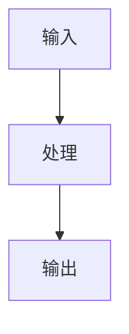
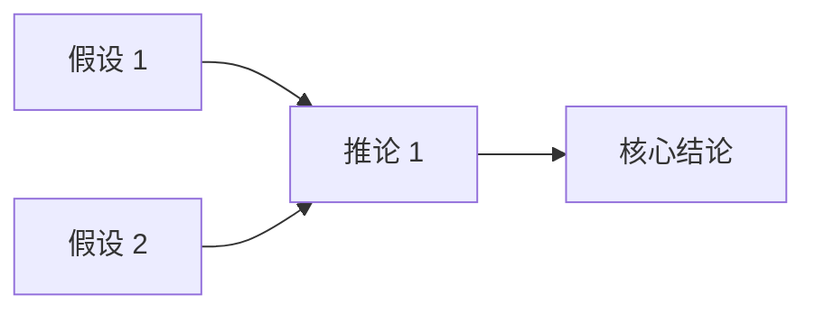

# 文章模板（按文档类型自动选择）

> 实际生成时，根据检测到的文档类型，仅保留对应模板段落，删除其余。

---

## 模板 1：技术实操类 — 核心卡片

---
title: "<标题>"
parent: "<主题显示名>"
nav_order: NN
---

# <标题>

> **一句话定义**
> 用通俗的话解释它解决什么问题。

## 核心架构 / 工作原理

用简洁的步骤或图表逻辑说明。



## 快速上手步骤

1. **步骤 1**：核心操作/代码
2. **步骤 2**：核心操作/代码
3. **步骤 3**：核心操作/代码
4. **步骤 4**：核心操作/代码（可选）
5. **步骤 5**：核心操作/代码（可选）

> 关键代码示例：
> ```bash
> # 示例命令
> command --flag value
> ```

## 踩坑避坑指南

| 场景 | 问题现象 | 原因 | 解决/最佳实践 |
|------|----------|------|---------------|
| 场景 1 | 报错/异常 | 根因 | 修正方法 |
| 场景 2 | 性能差 | 根因 | 优化建议 |

## 替代方案对比

| 维度 | 本工具 | 替代品 A | 替代品 B |
|------|--------|----------|----------|
| 优势 | ✅ | ❌ | ⚠️ |
| 劣势 | ⚠️ | ✅ | ✅ |
| 适用场景 | ... | ... | ... |

---

## 模板 2：考证培训类 — 备考复习

---
title: "<标题>"
parent: "<主题显示名>"
nav_order: NN
---

# <标题>

## 考点提炼

- **核心概念 1**：定义解释（**关键词**）
- **核心概念 2**：定义解释（**关键词**）
- **核心概念 3**：定义解释（**关键词**）

## 逻辑框架（知识树）

```text
主标题
├── 一级分支 A
│   ├── 二级知识点 A1
│   └── 二级知识点 A2
└── 一级分支 B
    ├── 二级知识点 B1
    └── 二级知识点 B2
```

## 易混淆概念对比

| 概念 | 定义 | 关键区别 | 记忆锚点 |
|------|------|----------|----------|
| A | ... | ... | ... |
| B | ... | ... | ... |

## 高频考法 / 应用场景

1. **考法 1**：描述典型题型/场景
2. **考法 2**：描述典型题型/场景
3. **易错陷阱**：常见误选项/易混淆点

## 记忆口诀 / 速记总结

> **口诀**：xxx
>
> **速记**：xxx

---

## 模板 3：理论学术类 — 费曼学习法

---
title: "<标题>"
parent: "<主题显示名>"
nav_order: NN
---

# <标题>

## 核心概念大白话

> 用 12 岁小孩能听懂的比喻解释这个理论。
>
> **比喻**：xxx 就像 xxx，因为 xxx。

## 理论背景与痛点

- **提出背景**：时代/领域/问题
- **前人局限**：之前理论无法解释/解决什么
- **核心突破**：本理论如何填补空白

## 核心支柱 / 推演逻辑

1. **假设/公理 1**：xxx
2. **假设/公理 2**：xxx
3. **推演链条**：A → B → C → 结论



## 现实应用案例

### 案例 1：<场景>
- **问题**：...
- **应用理论**：...
- **结果**：...

### 案例 2：<场景>
- **问题**：...
- **应用理论**：...
- **结果**：...

## 限制与边界

| 条件 | 失效表现 | 说明 |
|------|----------|------|
| 前提假设不成立 | ... | ... |
| 超出适用范围 | ... | ... |

---

## 模板 4：长文泛读类 — 金字塔原理

---
title: "<标题>"
parent: "<主题显示名>"
nav_order: NN
---

# <标题>

## 核心观点（TL;DR）

1. **结论 1**：...
2. **结论 2**：...
3. **结论 3**：...

## 关键论据 / 支撑点

| 论点 | 关键数据/事实 | 来源/出处 |
|------|---------------|-----------|
| 论点 1 | 数据/事实 | 章节/页码 |
| 论点 2 | 数据/事实 | 章节/页码 |
| 论点 3 | 数据/事实 | 章节/页码 |

## 启发与行动点

- **对我有什么指导**：...
- **下一步可以做**：
  1. 行动 1
  2. 行动 2
  3. 行动 3

---

## 通用尾部（所有模板共用）

## 参考来源

- 来源 1：<原始素材章节/页码/URL>
- 来源 2：<原始素材章节/页码/URL>

---

> **下一篇**：[<下一篇标题>](NN-next-slug.md)