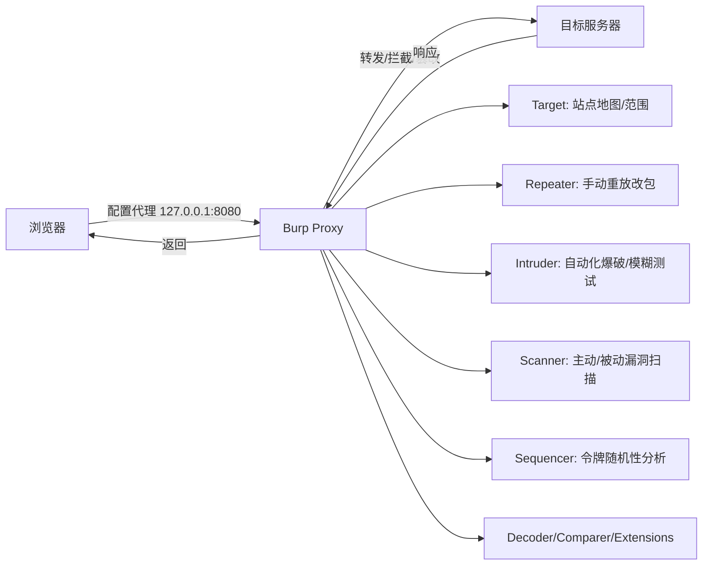

# Burp Suite 是什么 & Web 安全测试方法论

## 一句话定义
Burp Suite 是 Java 编写的 Web/API 安全测试平台，核心架构是**中间人代理**——拦截浏览器与目标服务器间的所有请求/响应，集成爬取、手测、爆破、扫描、报告全流程工具链。

## 核心架构 / 工作原理



| 核心模块 | 定位 | 典型用法 |
|----------|------|----------|
| Proxy | 流量中枢、拦截改包 | 开启 Intercept、配置匹配替换、导出 CA 证书 |
| Target | 站点地图、Scope 管理 | 看爬取覆盖、圈定测试范围、标记重点节点 |
| Repeater | 单包精细手测 | 手工构造 Payload、验证漏洞、绕过 WAF |
| Intruder | 批量自动化攻击 | 爆破账号、遍历 ID、参数污染、Cluster bomb 组合 |
| Scanner | 漏洞自动发现 | 被动扫描(安全)、主动扫描(真攻击、需授权) |
| Sequencer | 会话令牌熵分析 | 采集 1000+ 样本 → 判断随机性是否达标 |

## 快速上手步骤

1. **下载安装**：<https://portswigger.net/burp/releases> → Community(免费)或 Pro(付费)
2. **启动配置内存**：`-Xmx4G` 起步(大项目建议 8G+)；`burpsuite_pro_v2024.x.jar`
3. **配置浏览器代理**：系统/浏览器 → 127.0.0.1:8080；推荐 **FoxyProxy** 一键切换
4. **装 CA 证书**：访问 `http://burp` → 下载 → 导入系统"受信任的根证书颁发机构" → 验证 HTTPS 能看明文
5. **圈定 Scope**：Target → Site map → 右键目标宿主 → Add to scope → 勾选 "Show only in-scope"
6. **建项目/会话**：Project options → Sessions → Save/Load 项目文件(含配置/历史/范围)

```bash
# 启动参数示例
java -jar -Xmx8G burpsuite_pro.jar --user-config-file=~/burp-config.json
```

## 踩坑避坑指南

| 场景 | 问题现象 | 原因 | 解决/最佳实践 |
|------|----------|------|---------------|
| HTTPS 全报错/不显示 | "Certificate Unknown" | CA 证书未装入系统根存储 | 必须导入"受信任的根证书颁发机构"；Firefox 需单独导入其证书库 |
| 流量不过 Burp | Proxy 标签无记录 | 端口冲突/代理未生效/证书不信任 | `netstat -an | grep 8080` 查占用；用 FoxyProxy 强制走代理 |
| 扫描把生产打挂 | 服务宕机/数据脏/账号锁 | 未圈 Scope/扫描强度过大/含破坏性请求 | **先圈 Scope**；扫描配置排除登录/支付/删除接口；用 "Scan speed" 滑块限速 |
| 只会点 Scanner | 漏报授权/逻辑/业务漏洞 | 扫描器只覆盖已知特征漏洞 | **Repeater 手测核心业务流**；Intruder 遍历 IDOR；Sequencer 测令牌 |
| 协作/换机器配置丢 | 重装后全没了 | 未导出项目配置 | 定期 `Project options → Save project`；团队共享 `.burp` 项目文件 |

## 替代方案对比

| 维度 | Burp Suite Pro | Burp Suite Community | OWASP ZAP | Caido |
|------|----------------|---------------------|-----------|-------|
| 价格 | $449/年 | 免费 | 免费 | 免费/商业版 |
| 扫描器 | 商业级规则库、IAST、扩展 | 仅被动扫描 | 社区规则 | 较弱 |
| 手测工具 | Repeater/Intruder/Organizer 强 | Repeater 基础版 | 同级 | 现代 UI、强 |
| 插件生态 | BApp Store 丰富 | 受限 | Marketplace 丰富 | 新兴 |
| 自动化/CI | CLI/API/Bamboo/Jenkins | 无 | Docker/GitHub Actions/API | CLI |
| 学习曲线 | 陡峭 | 中等 | 中等 | 平缓 |
| 适用场景 | 专业渗透/赏金/企业 | 学习/简单测试 | 入门/预算 0 | 现代团队/手测为主 |

---

> 参考来源：*Burp Suite Cookbook (2023)*（本文为原创讲解，非转载原文）

*下一篇：[安装配置与代理：让浏览器流量过 Burp](02-安装配置与代理.md)*