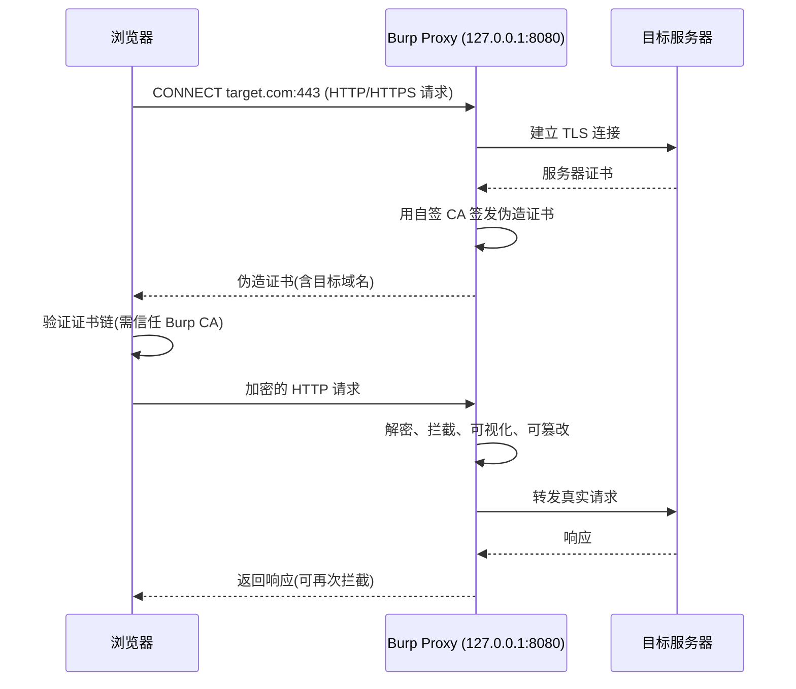

# 安装配置与代理：让浏览器流量过 Burp

## 一句话定义
代理是 Burp 的中枢——浏览器把 HTTP/HTTPS 流量发到 Burp 监听端口(默认 8080)，Burp 再转发；HTTPS 明文查看需浏览器信任 Burp 自签 CA 证书。

## 核心架构 / 工作原理



| 关键组件 | 配置位置 | 核心参数 |
|----------|----------|----------|
| 监听器 Listener | Proxy → Options → Proxy Listeners | Bind address(默认 127.0.0.1)、Port(默认 8080)、Loopback only、Support invisible proxying |
| CA 证书 | Proxy → Options → CA Certificate | 生成/导出/导入、密钥长度(2048/4096)、有效期 |
| 拦截规则 | Proxy → Intercept → Intercept rules | URL 正则、方法、状态码、内容类型、请求/响应/双向 |
| 匹配替换 | Proxy → Options → Match and Replace | 请求/响应头/体、正则替换、自动去 CSP/增加 Header |
| 上游代理 | Proxy → Options → Upstream Proxy Servers | 级联公司代理/另一 Burp 实例/SSH 隧道 |

## 快速上手步骤

1. **启动 Burp** → Proxy 标签 → 确认 "Intercept is off"(绿按钮)
2. **配置浏览器代理**：
   - 系统代理 → 127.0.0.1:8080
   - **推荐**：装 **FoxyProxy Standard** → 新建代理规则 → 一键开关
3. **导入 CA 证书**：
   - 浏览器访问 `http://burp` → 点 "CA Certificate" 下载 `cacert.der`
   - **Chrome/Edge/系统**：设置 → 隐私安全 → 证书管理 → 受信任的根证书颁发机构 → 导入
   - **Firefox**：设置 → 隐私与安全 → 证书 → 查看证书 → 证书颁发机构 → 导入 → 勾选"信任该证书标识网站"
4. **验证**：访问任意 HTTPS 站点(如 `https://example.com`) → Burp Proxy → HTTP history 出现明文请求/响应
5. **设 Scope**：Target → Site map → 右键目标域名 → Add to scope → Target → Scope → 勾选 "Show only in-scope items"
6. **配置拦截规则(可选)**：Proxy → Intercept → 添加规则 → 如只拦截 `/api/*` POST 请求

```bash
# 无头模式启动(用于 CI/服务器)
java -jar burpsuite_pro.jar --headless --disable-auto-update
```

## 踩坑避坑指南

| 场景 | 问题现象 | 原因 | 解决/最佳实践 |
|------|----------|------|---------------|
| 装了证书仍不信任 | 浏览器仍报"证书无效" | 证书导错了存储区(进了中间证书而非根) | **必须导入"受信任的根证书颁发机构"**；Firefox 需单独导入 |
| 移动端/模拟器抓不到包 | 手机配置代理后无网络 | 手机与 Burp 不同网段/防火墙拦截 | 同一 WiFi/热点；Burp Listener Bind address 改 `0.0.0.0`；关宿主机防火墙 8080 |
| 全局代理开着日常上网卡 | 所有流量走 Burp 慢/乱 | 未用分流工具 | **必装 FoxyProxy**：只对目标域名/端口走代理，其它直连 |
| 拦截开着页面打不开 | 浏览器一直转圈 | Intercept is on，每个请求卡住等放行 | 点 "Intercept is on" 变绿关闭；或加规则只拦关键接口 |
| 公司有上级代理 | Burp 连不上外网 | 需级联上级代理 | Proxy → Options → Upstream Proxy Servers → Add → 填公司代理 IP:Port |
| 证书过期/换机器 | 之前导入的证书失效 | Burp 重启重新生成 CA/有效期到 | 导出固定 CA 文件(Proxy → Options → CA Certificate → Export) → 团队共享同一套证书 |

## 替代方案对比

| 维度 | Burp Proxy | OWASP ZAP Proxy | mitmproxy | Chrome DevTools Network |
|------|------------|-----------------|-----------|-------------------------|
| 拦截改包 | ✅ 强(规则/断点) | ✅ 中等 | ✅ Python 脚本可编程 | ❌ 只读 |
| HTTPS 解密 | ✅ 自签 CA | ✅ 自签 CA | ✅ 自签 CA | ❌ 无 |
| 非 HTTP 协议 | WebSocket/HTTP2 | WebSocket/HTTP2 | TCP/任意协议 | 仅 HTTP/WS |
| 自动化脚本 | 扩展/BApp | 脚本/插件 | 原生 Python API | 仅 Console |
| 性能/内存 | 高(Java) | 高(Java) | 低(Python) | 极低(内置) |
| 适用场景 | 专业渗透/全协议 | 入门/开源 | 开发者/自动化集成 | 前端调试 |

---

> 参考来源：*Burp Suite Cookbook (2023)*（本文为原创讲解，非转载原文）

*下一篇：[核心工具全景：Proxy/Target/Repeater/Intruder/Decoder](03-核心工具全景.md)*

> 💡 **配图建议**：在"核心架构"处放序列图演示 HTTPS 解密全过程(浏览器→Burp→服务器双向 TLS)；在"快速上手"处放 FoxyProxy 规则配置截图(目标域名模式、代理地址、开关状态)；在"CA 证书"处放证书导入对话框截图(强调选"受信任的根证书颁发机构")。