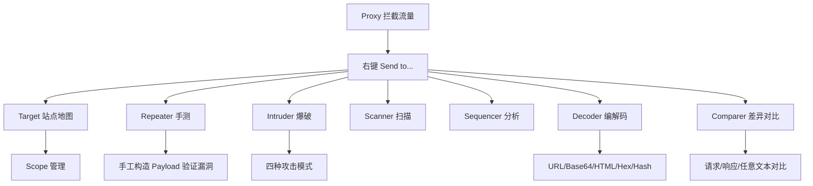

# 核心工具全景：Proxy/Target/Repeater/Intruder/Decoder

## 一句话定义
Burp 把测试动作拆成专用标签页：**Proxy** 抓包改包、**Target** 测绘站点、**Repeater** 单包精细手测、**Intruder** 批量自动化攻击、**Decoder/Comparer** 辅助编解码与差异对比。

## 核心架构 / 工作原理



| 工具 | 核心能力 | 典型场景 | 进阶技巧 |
|------|----------|----------|----------|
| **Proxy** | 拦截、改包、匹配替换、上游代理 | 看明文、改参数、去 CSP、改 Header | 正则匹配替换自动化改包 |
| **Target** | 站点地图、Scope、Issue 列表 | 发现隐藏端点、圈定范围、看扫描结果 | 右键"Show only in-scope"清理噪音 |
| **Repeater** | 单请求重放、改包、历史记录、渲染 | 手测 SQLi/XSS/IDOR/逻辑漏洞 | `Ctrl+R` 发送、`Ctrl+Shift+R` 跟随重定向、渲染 HTML/JSON |
| **Intruder** | 位置标记、载荷集、四种攻击类型、Grep 提取 | 爆破、遍历、模糊测试、参数污染 | Cluster bomb 笛卡尔积、Pitchfork 并行、Grep-match 标记关键字 |
| **Decoder** | 编码/解码/哈希/压缩 | 解混淆参数、造 Payload、算签名 | 多层解码链、智能识别编码 |
| **Comparer** | 词/字节级对比、高亮差异 | 对比两次响应、定位注入差异 | Words 模式看语义差异、Bytes 看二进制差异 |

## 快速上手步骤

1. **Proxy → Target 流转**：Proxy HTTP history 右键请求 → Send to Target → 站点地图自动补全
2. **Repeater 手测闭环**：
   - 选中请求 → `Ctrl+R` 发送 → 看响应
   - 改参数/Header/Body → 再发
   - 历史记录树自动保存每次修改版本，点节点回溯
3. **Intruder 爆破流程**：
   - Send to Intruder → Positions 标签 → `§` 标记位置(如 `username=§admin§&password=§123§`)
   - Payloads 标签 → 载荷类型(Simple list/Brute forcer/Recursive grep/Null payloads)
   - Attack → 结果表看状态码/长度/响应时间/Grep 匹配
   - 四种攻击类型选对：
     - **Sniper**：单点位置逐个载荷(单参数爆破)
     - **Battering ram**：同一载荷填多位置(同值多处)
     - **Pitchfork**：多载荷集并行(用户名/密码对应)
     - **Cluster bomb**：所有载荷组合笛卡尔积(全排列)
4. **Decoder 快捷操作**：选中文本 → `Ctrl+Shift+D` 打开 Decoder → 智能识别/手选编码 → 解码/编码/哈希
5. **Comparer 对比**：选两请求/响应 → 右键 Send to Comparer → 选 Words/Bytes → 看高亮差异

```bash
# Intruder 载荷生成示例(命令行生成字典)
seq 1 1000 | sed 's/^/id=/'> ids.txt  # 遍历 ID
crunch 4 4 0123456789 > pins.txt      # 4位数字 PIN
```

## 踩坑避坑指南

| 场景 | 问题现象 | 原因 | 解决/最佳实践 |
|------|----------|------|---------------|
| Intruder 跑飞/太慢 | 请求数百万、目标挂了 | Cluster bomb 组合爆炸/未限速 | **先小范围验证**；Options → Throttle 限速(如 10 req/s)；设最大并发/超时 |
| Repeater 响应乱码 | 看不懂返回内容 | 编码/压缩/加密 | Decoder 解码；或 Proxy → Options → Match and Replace 自动解 gzip/deflate |
| Target 地图太乱 | 噪音太多找不到重点 | 未圈 Scope/爬了外链 | **严格圈 Scope**；勾选 "Show only in-scope"；用 Engagement tools 针对性爬取 |
| Comparer 对比不出差异 | 全绿/全红 | 选错模式/内容动态变化 | 先去动态字段(时间戳/CSRF token/nonce)再对比；用正则替换剔除 |
| Decoder 识别错编码 | 解出乱码 | 多层编码/非标准编码 | 多次 Decode；或写脚本处理自定义编码 |

## 替代方案对比

| 维度 | Burp 核心工具链 | OWASP ZAP | Postman | 命令行工具 |
|------|----------------|-----------|---------|------------|
| 手测灵活性 | ✅ 极强(Repeater) | ✅ 强 | ⚠️ 中(Collection Runner) | ✅ curl/HTTPie |
| 批量自动化 | ✅ Intruder 成熟 | ✅ Fuzzer | ✅ Data-driven | ✅ ffuf/nuclei |
| 编解码 | ✅ Decoder 可视化 | ✅ 内置 | ⚠️ Pre-request Script | ✅ jq/base64/xxd |
| 差异对比 | ✅ Comparer 高亮 | ⚠️ 弱 | ❌ 无 | ✅ diff/meld |
| 学习成本 | 高 | 中 | 低 | 中(需记参数) |

---

> 参考来源：*Burp Suite Cookbook (2023)*（本文为原创讲解，非转载原文）

*下一篇：[爬取、主动扫描与报告生成](04-爬取扫描与报告.md)*

> 💡 **配图建议**：在"核心架构"处放工具间右键 Send to 菜单截图；在"Intruder 四种攻击类型"处放表格配图示意(每种类型的位置/载荷对应关系)；在"Repeater"处放 Repeater 界面截图(左侧历史树、右侧请求/响应标签、渲染按钮)。