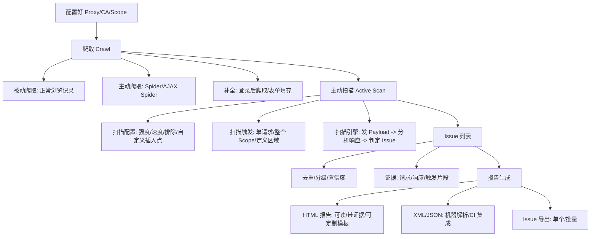

# 爬取、主动扫描与报告生成

## 一句话定义
**爬取**补全站点地图，**主动扫描**发变形攻击包验证漏洞，**报告**把 Issue 整理成可交付的 HTML/XML/JSON 证据文档。

## 核心架构 / 工作原理



| 阶段 | 关键配置 | 典型参数 |
|------|----------|----------|
| **爬取** | Engagement tools → New crawl | 爬取深度、线程数、表单自动填充、登录宏、AJAX Spider 开关 |
| **主动扫描** | Scan configuration / Live scanning | 扫描强度(Light/Normal/Thorough)、速度(快/中/慢)、插入点位置、排除路径/参数、自定义扫描规则 |
| **报告** | Report → Generate report | 报告模板、包含范围(所有/选中)、证据详细度、品牌/Logo、导出格式 |

## 快速上手步骤

1. **爬取补全地图**：
   - Target → Site map → 右键目标 → Engagement tools → New crawl
   - 配置：深度 3-5、线程 5-10、勾选"Crawl login protected areas" → 选录制好的登录宏
   - 或：AJAX Spider 标签 → 选 Context → Start(针对 SPA)
2. **主动扫描**：
   - 单请求：Proxy/Target 右键请求 → Do active scan
   - 整体：Target → Scope 内右键 → Actively scan this host
   - 调策略：Scanner → Scan configuration → New → 调强度/速度/排除 → Save as "Gentle Scan"
3. **看扫描进度**：Scanner → Live scanning / Scan queue 标签；页脚扫描器状态
4. **处理 Issue**：
   - Dashboard → Issues 列表 → 按 Severity/Confidence 排序
   - 双击 Issue → 看 Advisory/Request/Response/Trigger evidence
   - 误报右键 → False positive 标记
5. **生成报告**：
   - Report → Generate HTML report → 选模板(Standard/Executive/PCI DSS 等)
   - 勾选"Include request/response evidence" → 生成 → 发给开发/管理层

```bash
# CLI 生成报告(无头模式)
java -jar burpsuite_pro.jar --headless \
  --project-file=project.burp \
  --scan-configuration=Gentle Scan \
  --report-file=report.html \
  --report-format=HTML
```

## 踩坑避坑指南

| 场景 | 问题现象 | 原因 | 解决/最佳实践 |
|------|----------|------|---------------|
| 爬不到登录后页面 | 只爬到登录页 | 未配登录宏/Session Handling | 录制登录宏(Project options → Sessions → Macros) → Crawl 配置选中该宏 |
| 扫描把站打挂/锁账号 | 服务宕机/账号锁定/脏数据 | 强度太大/含破坏性请求/无节制 | **排除登录/支付/删除/状态修改接口**；用"Gentle Scan"配置；设最大并发/请求延迟 |
| 扫描卡住/极慢 | 队列不动/几小时无进展 | 参数组合爆炸/目标响应慢/陷入循环 | 设最大扫描时间/每插入点最大请求数；排除高基数参数(如 search=*) |
| 报告太大/打不开 | HTML 几百 MB/浏览器崩 | 包含所有请求响应原文 | 报告配置只含 Issue 证据；或导出 XML/JSON 给工具解析 |
| 误报太多吵开发 | 开发不信任报告 | 扫描器特征匹配产生假阳性 | **人工复核高/中危**；False positive 标记；只报可复现漏洞 |

## 替代方案对比

| 维度 | Burp Scanner Pro | OWASP ZAP Active Scan | Nuclei | 自建扫描器 |
|------|------------------|----------------------|--------|------------|
| 规则质量 | 商业级、更新快、IAST 增强 | 社区规则、较基础 | 社区模板、极丰富、更新极快 | 完全自控、维护成本高 |
| 爬取能力 | 登录宏/AJAX/表单填充强 | AJAX Spider 配置繁琐 | 无(需外部爬虫) | 需自己写 |
| 误报率 | 低(商业引擎+验证) | 中等 | 低(模板精确) | 可控 |
| 报告质量 | 专业模板、可定制、证据完整 | 基础 HTML/JSON | 简易 JSON/Markdown | 自定 |
| CI/CD 集成 | CLI/API/Bamboo/Jenkins 插件 | Docker/GitHub Actions/API | 原生 CLI 极简 | 灵活 |
| 成本 | $449/年 + 算力 | 免费 | 免费 | 人力高 |

---

> 参考来源：*Burp Suite Cookbook (2023)*（本文为原创讲解，非转载原文）

*下一篇：[认证机制测试：枚举、弱锁定、绕过登录](05-认证机制测试.md)*

> 💡 **配图建议**：在"爬取配置"处放 Engagement tools 新建爬取对话框截图(登录宏选择、表单填充、深度设置)；在"扫描配置"处放 Scan configuration 编辑界面截图(强度滑块、速度、插入点、排除列表)；在"报告"处放报告生成向导截图(模板选择、证据选项、品牌定制)。