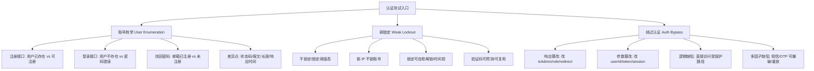

# 认证机制测试：枚举、弱锁定、绕过登录

## 一句话定义
认证测试核心三件事：**账号枚举**(接口泄露用户是否存在)、**弱锁定**(爆破可行)、**绕过认证**(逻辑缺陷跳过登录)——用 Burp Repeater/Intruder/Comparer 验证。

## 核心架构 / 工作原理



| 测试点 | 核心动作 | Burp 工具 | 判定标准 |
|--------|----------|-----------|----------|
| **账号枚举** | 遍历用户名/邮箱 → 对比响应差异 | Intruder(Cluster bomb) + Comparer | 状态码/错误文案/响应长度/时间 有统计学显著差异 |
| **弱锁定** | 连续输错 N 次 → 观察锁定行为 | Intruder(Sniper) + Repeater | 无锁定/锁 IP 不锁账号/锁定可绕过/验证码弱 |
| **绕过登录** | 登录成功后改包/改响应 → 访问受保护资源 | Repeater(改响应) + Proxy(拦截改包) | 无需凭证访问到受保护页面/接口 |

## 快速上手步骤

1. **测账号枚举**：
   - 抓登录/注册/找回密码请求 → Send to Intruder
   - Positions: 标记 `username`/`email` 位置 `§user§`
   - Payloads: Simple list → 导入用户名字典(常用名/泄露库/员工名单)
   - Attack → 结果表看 Status/Length/Response time → 导出差异行 → Comparer 精确对比
2. **测弱锁定**：
   - Intruder Sniper 模式 → 同一账号连续错密码 20+ 次
   - 观察：是否返回锁定提示/状态码 429/账号锁定时间/解锁方式
   - 并行测：换 IP/代理池 → 看是否绕过 IP 锁定
   - 验证码：识别验证码接口 → 单独测验证码可预测性/复用性
3. **测绕过认证**：
   - 正常登录 → 拦截响应 → Repeater 改 `role: "user"` → `role: "admin"` / `isAuthenticated: true` / `redirect: "/admin"`
   - 直接访问受保护 URL(如 `/admin/dashboard`) → 看是否 302 跳登录或 200 直接进
   - 测 JWT/Token：登录拿 token → Decoder 解码 → 改声明(roles/exp) → 重签/不签 → Repeater 带上测
4. **REST API 账号枚举**：同理，针对 `/api/users` `/api/auth/check-username` 等接口

```bash
# 生成用户名字典(示例)
cewl https://target.com -d 2 -w usernames.txt  # 爬站点词
cat /usr/share/seclists/Usernames/top-usernames-shortlist.txt >> usernames.txt
```

## 踩坑避坑指南

| 场景 | 问题现象 | 原因 | 解决/最佳实践 |
|------|----------|------|---------------|
| 只看错误文案 | 以为"用户不存在"就是安全 | 差异藏在状态码/长度/时间 | **Comparer 全维度对比**：Status Code、Response Length、Response Time、Error Message、Header(如 X-User-Exists) |
| 锁 IP 以为安全 | 攻击者用代理池绕过 | 锁定未绑定账号身份 | **必须锁账号**；锁定后需管理员/邮件/短信解锁，非自动解锁 |
| 前端隐藏按钮以为安全 | 直接调后端接口绕过 | 认证判定在前端/响应体 | **所有权限判定必须在服务端**；前端只做体验 |
| JWT 改了不重签 | 改 alg=none/弱密钥/不验签 | 服务端校验不严 | 测试：alg=none、HS256 弱密钥爆破、RS256 公钥混淆、kid 注入、关键声明篡改 |

## 替代方案对比

| 维度 | Burp 手测认证 | OWASP ZAP | 专用工具 | 代码审计 |
|------|---------------|-----------|----------|----------|
| 枚举灵活性 | ✅ Intruder+Comparer 精准 | ✅ Fuzzer | ✅ username-enum-tools | ✅ 源码级全覆盖 |
| 锁定测试 | ✅ 可模拟真实攻击流 | ⚠️ 基础 | ✅ 专用爆破工具 | ❌ 运行时才见 |
| 绕过测试 | ✅ Repeater 改包/改响应最直观 | ✅ 类似 | ❌ 无 | ✅ 逻辑级全覆盖 |
| 自动化 | ⚠️ 需宏/扩展 | ✅ Authentication 配置 | ✅ 原生 | ❌ 静态分析 |

---

> 参考来源：*Burp Suite Cookbook (2023)*（本文为原创讲解，非转载原文）

*下一篇：[授权检查：遍历/LFI/RFI、权限提升、IDOR](06-授权检查.md)*

> 💡 **配图建议**：在"账号枚举"处放 Intruder 结果表截图(显示 Length/Status 差异行高亮)；在"Comparer 对比"处放 Comparer 双栏对比截图(Words 模式高亮差异词)；在"绕过认证"处放 Repeater 改响应截图(把 `role:user` 改为 `role:admin` 的前后对比)。