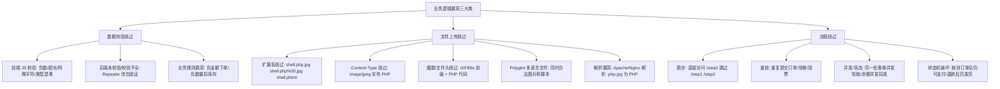

# 业务逻辑测试：校验、文件上传绕过、流程绕过

## 一句话定义
业务逻辑漏洞是功能"按设计工作"但设计可被滥用：前端校验可绕过、文件上传可传 Webshell、流程顺序可跳过、并发可破坏状态机——靠 **Repeater/Intruder 手测** 逼出。

## 核心架构 / 工作原理



| 漏洞类型 | 典型入口 | 测试手法 | 成功判定 |
|----------|----------|----------|----------|
| **数据校验** | 所有输入参数(Body/Query/Header/Cookie) | Repeater 改参数 → 看后端是否拦截/报错/执行 | 后端接受非法值并产生业务影响(负金额订单/超长截断/类型混淆) |
| **文件上传** | 头像/附件/导入/富文本图片 | 组合测：扩展名+Content-Type+魔数+Polyglot → 看是否落盘可执行 | 上传成功 + 访问路径执行代码/回显 Webshell |
| **流程跳步** | 多步表单/向导/结账流程 | 直接请求后续步骤 URL/接口 → 看是否校验前置状态 | 无前置校验直接成功 |
| **重放/竞态** | 幂等性差的接口(领券/下单/投票/转账) | Intruder 并发/循环发送同一请求 → 看是否重复生效 | 同一请求多次成功产生重复业务效果 |

## 快速上手步骤

1. **测数据校验**：
   - 正常操作抓包 → Send to Repeater
   - 逐个参数注入边界值：负数 `-1`、超长 `A*10000`、特殊字符 `<script>` `'` `;` `../`、类型混淆(数字传字符串、数组传对象)
   - 看响应：200 且业务生效 = 校验缺失；400/报错 = 有校验
2. **测文件上传**：
   - 找上传接口 → Repeater 改 `filename` `Content-Type` `Body`
   - 组合矩阵测试(建表逐行验证)：
     | 扩展名 | Content-Type | 魔数 | 备注 |
     |--------|--------------|------|------|
     | shell.php | application/x-php | `<?php` | 基础 |
     | shell.php.jpg | image/jpeg | GIF89a | 双重后缀 |
     | shell.phtml | application/x-httpd-php | `<?php` | 解析漏洞 |
     | shell.phar | application/octet-stream | `<?php` | PHAR 反序列化 |
     | polyglot.gif | image/gif | GIF89a + `<?php` | 图片+脚本 |
   - 上传成功后 → 访问返回的文件 URL → 看是否执行/回显
3. **测流程绕过**：
   - 画出业务流程图(步骤 1→2→3→4)
   - 直接请求步骤 3/4 接口 → 看是否需步骤 1/2 的 Token/Session 状态
   - 完成流程后 → 重放步骤 2/3 请求 → 看是否重复生效
   - Intruder 并发 50+ 线程发同一请求 → 看数据库/业务是否异常

```bash
# 生成 Polyglot GIF+PHP (需先有真 GIF)
cat shell.php >> legit.gif > polyglot.gif
# 或用工具
exiftool -Comment="<?php system($_GET['cmd']); ?>" legit.jpg -o polyglot.jpg
```

## 踩坑避坑指南

| 场景 | 问题现象 | 原因 | 解决/最佳实践 |
|------|----------|------|---------------|
| 前端报错以为后端也拦 | 只在浏览器试、没抓包改包 | 前端校验 ≠ 后端校验 | **所有输入必须在 Burp 里二次验证后端** |
| 只传正常文件测上传 | 发现不了绕过 | 测试面太窄 | **组合矩阵全测**：扩展名 × Content-Type × 魔数 × 解析漏洞 |
| 按正常顺序走完就放心 | 忽略跳步/重放/并发 | 只测 Happy Path | **故意破坏流程**：跳步、重放、并发、逆序、中断恢复 |
| 以为重名覆盖就安全 | 忽略路径遍历/存储路径可控 | 存储逻辑缺陷 | 测 `filename=../../../var/www/shell.php`、测存储桶/云存储 ACL 配置 |

## 替代方案对比

| 维度 | Burp 手测业务逻辑 | OWASP ZAP | 自动化扫描器 | 代码审计 |
|------|-------------------|-----------|--------------|----------|
| 校验绕过 | ✅ Repeater 精细 | ✅ Fuzzer | ⚠️ 有限 | ✅ 源码级 |
| 文件上传 | ✅ 组合矩阵手测 | ✅ 类似 | ⚠️ 基础规则 | ✅ 存储/解析逻辑 |
| 流程/竞态 | ✅ Intruder 并发/序列 | ⚠️ 脚本 | ❌ 无语义理解 | ✅ 状态机分析 |
| 发现率 | 高(需懂业务) | 中 | 低 | 高(需懂代码) |

---

> 参考来源：*Burp Suite Cookbook (2023)*（本文为原创讲解，非转载原文）

*下一篇：[输入校验与注入：XSS、动词篡改、参数污染、SQL/命令注入](09-输入校验与注入.md)*

> 💡 **配图建议**：在"文件上传矩阵"处放测试表格截图(扩展名/Content-Type/魔数/结果列)；在"流程绕过"处放业务流程图(步骤1-4 + 跳步箭头)；在"竞态测试"处放 Intruder 并发结果截图(多个 200 响应、数据库重复记录)。