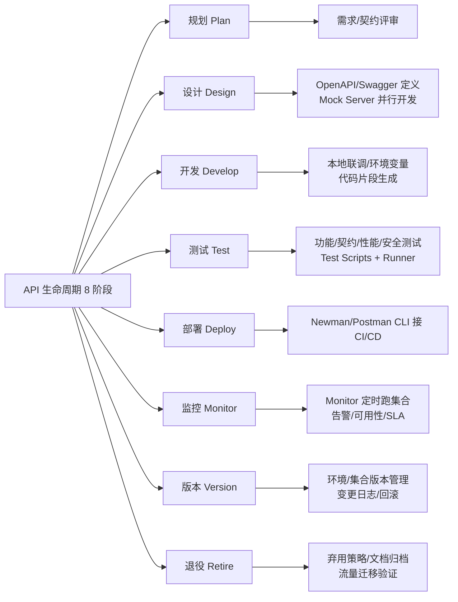

# Postman 与 API 全生命周期

## 一句话定义
Postman 是覆盖 API **全生命周期**（规划→设计→开发→测试→部署→监控→版本→退役）的协作平台，把原本割裂的工具链串成单一工作台。

## 核心架构 / 工作原理



| 阶段 | Postman 核心能力 | 产出物 |
|------|------------------|--------|
| **规划** | Workspace 协作、需求文档 | 需求清单、契约草案 |
| **设计** | **OpenAPI 编辑器**、**Mock Server**、示例生成 | 契约文档、Mock 端点、前端可调用接口 |
| **开发** | 请求构建、环境变量、代码片段、Snippets | 可复用请求模板、环境配置 |
| **测试** | **Test Scripts (pm.test)**、**Collection Runner**、数据驱动、Schema 校验 | 测试报告、覆盖率、缺陷单 |
| **部署** | **Postman CLI / Newman**、GitHub Actions/Jenkins 集成 | 自动化流水线、门禁报告 |
| **监控** | **Monitor**（多地域/定时/告警）、Flows 可视化编排 | 可用性仪表盘、SLA 报表、异常告警 |
| **版本** | 集合/环境版本控制、Fork/Pull Request、变更日志 | 版本化契约、灰度发布配置 |
| **退役** | 文档归档、弃用通知、流量切换验证 | 归档包、迁移指南 |

## 快速上手步骤

1. **建 Workspace 协作**：
   - 登录 Postman → New Workspace → Team/Private → 邀请成员
   - 一个 API 项目 = 一个 Workspace，集中管理集合/环境/文档
2. **设计期：契约先行**：
   - APIs 标签 → Create API → 导入/编写 OpenAPI 3.0 (YAML/JSON)
   - Generate Mock Server → 前端即刻联调，无需等后端
   - Save Example responses → 文档自动生成示例
3. **开发期：本地联调**：
   - Collections → New Request → 填 URL/Method/Params/Headers/Body
   - Environments → 定义 `base_url` `api_key` 等变量 → `{{base_url}}/users`
   - `</>` Code Snippet → 一键生成 cURL/Python/JS/Go 代码
4. **测试期：自动化回归**：
   - Tests 标签写 `pm.test("status 200", () => pm.response.to.have.status(200))`
   - Collection Runner → 选 Environment/Data File(CSV/JSON) → Run
   - Schema 校验：`pm.response.to.have.jsonSchema(schemaObj)`
5. **部署期：接入 CI/CD**：
   - 导出 Collection + Environment → `newman run coll.json -e env.json --reporters cli,json`
   - GitHub Actions: `.github/workflows/api-test.yml` 调用 Newman
6. **监控期：长期体检**：
   - Monitors → Create Monitor → 选 Collection/Environment/频率(5min/1h/1d)/Region
   - 失败 → Slack/Email/ PagerDuty 告警

```bash
# Newman 本地跑集合
newman run my-collection.json -e my-env.json -d data.csv --reporters cli,htmlextra

# Postman CLI (新版，支持云同步)
postman login --with-api-key <key>
postman collection run <collection-id> -e <env-id>
```

## 踩坑避坑指南

| 场景 | 问题现象 | 原因 | 解决/最佳实践 |
|------|----------|------|---------------|
| 只把 Postman 当 curl 用 | 只手动发请求、不写测试、不建 Mock | 认知局限 | **按生命周期用**：设计期建 Mock、开发期联调、测试期跑 Runner、部署期接 CI |
| 测试只在最后补 | 上线前才写脚本、覆盖率低 | 测试左移未落地 | **设计期即写 Contract Test**；Mock Server 验证契约；开发期同步补功能测试 |
| 环境变量硬编码在请求里 | 换环境要改几十个请求 | 未用 `{{var}}` 语法 | **全链路变量化**：URL、Header、Body、测试断言全用 `{{base_url}}` `{{token}}` |
| 敏感信息提交 Git | Collection/Environment 含真实 Token/密钥 | 导出时未脱敏 | **CI 用 Secrets 注入**；本地用 `.postman-env` 不入库；导出前用脚本脱敏 |
| 团队各自为战 | 集合/环境不同步、冲突频发 | 无 Workspace 规范 | **强制单一 Workspace**；用 Fork/PR 机制变更集合；定期 Sync |

## 替代方案对比

| 维度 | Postman 全生命周期 | SwaggerHub + 独立工具 | Insomnia + 独立工具 | 纯代码方案 |
|------|-------------------|----------------------|---------------------|------------|
| 契约设计 | ✅ OpenAPI 编辑器+Mock | ✅ 专业 | ⚠️ 基础 | ✅ 代码即文档 |
| Mock Server | ✅ 云端/本地/示例驱动 | ✅ 云端 | ✅ 本地 | ❌ 需自建 |
| 测试脚本 | ✅ JS/TypeScript、数据驱动、Schema | ❌ 无 | ✅ JS | ✅ 任意语言 |
| CI/CD 集成 | ✅ Newman/CLI/GitHub Actions 原生 | ⚠️ 需配置 | ✅ Inso CLI | ✅ 完全可控 |
| 监控/告警 | ✅ 云端 Monitor 多地域 | ❌ 无 | ❌ 无 | ❌ 自建 |
| 团队协作 | ✅ Workspace/版本/评论/审批 | ✅ 评论/版本 | ⚠️ 基础 | ❌ Git 管理 |
| 学习成本 | 中(功能全) | 中 | 低 | 高(需懂代码) |

---

> 参考来源：*Mastering Postman, Second Edition*（本文为原创讲解，非转载原文）

*下一篇：[安装、配置与界面导览](02-安装配置与界面导览.md)*