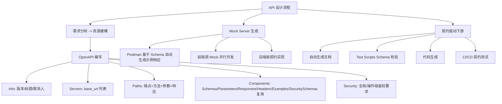

# API 设计原则与 OpenAPI 规范

## 一句话定义
**契约先行**：用 OpenAPI 3.0 (YAML/JSON) 定义端点/参数/响应 Schema，配合 **Mock Server** 让前后端并行开发——设计期只定契约，不写业务代码。

## 核心架构 / 工作原理



| 设计原则 | 规范做法 | 反例 |
|----------|----------|------|
| **资源名用名词复数** | `GET /books` `POST /books` `GET /books/{id}` | `/getBooks` `/createBook` `/bookById` |
| **HTTP 方法表达语义** | GET 查、POST 增、PUT 全量改、PATCH 部分改、DELETE 删 | 全用 POST、GET 删数据 |
| **版本策略** | URL 路径版本 `/v1/books` 或 Header `Accept-Version: v1` | 无版本、参数版本 `?v=1` |
| **状态码语义化** | 200 OK、201 Created、204 No Content、400 Bad Request、401 Unauthorized、403 Forbidden、404 Not Found、409 Conflict、422 Unprocessable、429 Too Many Requests、5xx Server Error | 全返回 200、错误码自定义 |
| **分页/过滤/排序标准化** | `?page=1&size=20&sort=-created_at&filter[status]=active` | 自定义参数名无规律 |
| **错误响应统一结构** | `{ "error": {"code": "VALIDATION_ERROR", "message": "...", "details": [...]}}` | 字符串/HTML/空响应 |

## 快速上手步骤

1. **在 Postman 建 API 契约**：
   - APIs 标签 → Create API → 名称 `Bookstore API` → Version `v1` → Schema Format: OpenAPI 3.0 → YAML
   - 编辑器写 OpenAPI (见下方最小示例) → Save
2. **生成 Mock Server**：
   - API 详情页 → Mock Server → Create Mock → 选 Environment → 生成 URL `https://<mock-id>.mock.pstmn.io`
   - 前端直接调 `GET https://<mock-id>.mock.pstmn.io/v1/books` → 返回示例数据
3. **关联 Collection 验证**：
   - Generate Collection from API → 生成的集合自带请求示例
   - Tests 里加 Schema 校验：`pm.response.to.have.jsonSchema(schema)`
4. **团队评审流程**：
   - Fork API → 改动 → Create Pull Request → Reviewers 评论 → Merge → 版本号升级

```yaml
# 最小 OpenAPI 3.0 示例 (Bookstore)
openapi: "3.0.3"
info:
  title: Bookstore API
  version: "1.0.0"
servers:
  - url: "https://api.bookstore.com/v1"
paths:
  /books:
    get:
      summary: List books
      parameters:
        - $ref: '#/components/parameters/page'
        - $ref: '#/components/parameters/size'
      responses:
        '200':
          description: OK
          content:
            application/json:
              schema:
                $ref: '#/components/schemas/BookList'
    post:
      summary: Create book
      requestBody:
        required: true
        content:
          application/json:
            schema:
              $ref: '#/components/schemas/BookCreate'
      responses:
        '201':
          description: Created
          content:
            application/json:
              schema:
                $ref: '#/components/schemas/Book'
components:
  schemas:
    Book:
      type: object
      required: [id, title, author, isbn, created_at]
      properties:
        id: {type: string, format: uuid}
        title: {type: string, maxLength: 200}
        author: {type: string}
        isbn: {type: string, pattern: '^\\d{13}$'}
        created_at: {type: string, format: date-time}
    BookCreate:
      type: object
      required: [title, author, isbn]
      properties:
        title: {type: string, maxLength: 200}
        author: {type: string}
        isbn: {type: string, pattern: '^\\d{13}$'}
    BookList:
      type: object
      required: [data, pagination]
      properties:
        data: {type: array, items: {$ref: '#/components/schemas/Book'}}
        pagination:
          type: object
          properties:
            page: {type: integer}
            size: {type: integer}
            total: {type: integer}
  parameters:
    page: {name: page, in: query, schema: {type: integer, default: 1}}
    size: {name: size, in: query, schema: {type: integer, default: 20}}
```

## 踩坑避坑指南

| 场景 | 问题现象 | 原因 | 解决/最佳实践 |
|------|----------|------|---------------|
| 设计期直接写代码 | 接口改动频繁、前后端对不上 | 无契约基线 | **强制契约先行**：OpenAPI 评审通过才准写实现 |
| Schema 字段类型随意写 | 生成的 Mock/文档/校验全错 | 类型不严谨 | **每字段必填 type/format/required/示例**；用 `pattern/enum/minLength/maxLength` 约束 |
| Mock Server 返回固定数据 | 前端联调不真实、分页/错误场景覆盖不了 | 未配多示例 | **同一端点加多个 Example**(成功/分页/空/400/401)；Mock 会轮询/按 Header 选 |
| 版本号不升级/乱改 | 消费方不知变更、破坏兼容 | 无版本治理 | **语义化版本**：Breaking change 升大版本(v1→v2)；非破坏升小版本；废弃策略文档化 |
| 安全定义缺失/错 | 生成的代码/测试无鉴权、文档误导 | SecuritySchemes 未配 | 必配 `components.securitySchemes` (Bearer/API Key/OAuth2)；操作级 `security` 指定 |

## 替代方案对比

| 维度 | Postman OpenAPI + Mock | SwaggerHub | Stoplight | 手写 YAML + 独立工具 |
|------|------------------------|------------|-----------|---------------------|
| 编辑体验 | ✅ 可视化+代码双模 | ✅ 专业编辑器 | ✅ 可视化强 | ⚠️ 纯手写 |
| Mock Server | ✅ 云端一体化、多示例 | ✅ 云端 | ✅ Prism 强 | ✅ Prism/WireMock 自建 |
| 团队评审 | ✅ Fork/PR/评论 | ✅ 评审流程 | ✅ 协作 | ❌ Git PR |
| 代码生成 | ✅ 内置/插件 | ✅ 官方生成器 | ✅ 模板化 | ✅ openapi-generator |
| 契约测试 | ✅ Schema 校验测试 | ⚠️ 需配置 | ✅ 内置 | ✅ Pact/Spring Cloud Contract |
| 价格 | 免费版可用 | 付费功能多 | 免费版可用 | 免费 |

---

> 参考来源：*Mastering Postman, Second Edition*（本文为原创讲解，非转载原文）

*下一篇：[用 Flask 搭建 API 后端与 CRUD](04-flask搭建api后端与crud.md)*