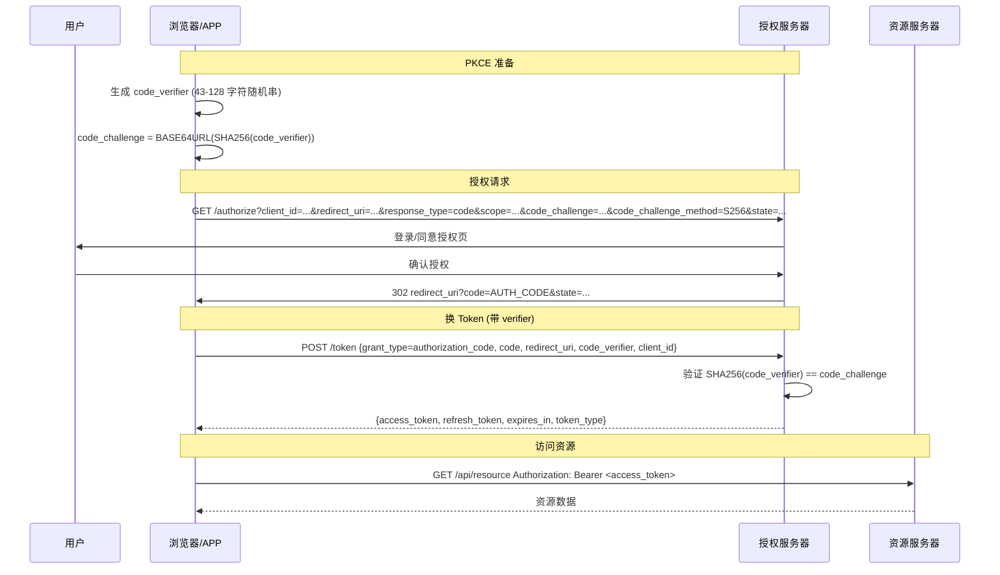

# OAuth 2.1 实战：PKCE 与令牌安全

## 一句话定义
OAuth 2.1 是 OAuth 2.0 的"安全合订本"：**强制公共客户端用 PKCE**、**废弃隐式流程/密码模式**、**推荐 Refresh Token 轮换**、**必须用 state 防 CSRF**——Postman 原生支持一键跑通。

## 核心架构 / 工作原理



| OAuth 2.1 关键变更 | 2.0 遗留问题 | 2.1 强制/推荐做法 |
|-------------------|--------------|-------------------|
| **PKCE 强制** | 公共客户端无 Client Secret，授权码可被拦截利用 | **所有公共客户端必须用 PKCE (S256)**；授权码换 Token 必须带 `code_verifier` |
| **废弃隐式流程** | Token 直接在 URL 片段返回，易泄露/被窃 | **禁止 Implicit Flow**；改用 Auth Code + PKCE |
| **废弃密码模式** | 客户端直接收集用户密码，违背委托授权初衷 | **禁止 Resource Owner Password Credentials**；改用设备码/浏览器流 |
| **Refresh Token 轮换** | Refresh Token 长期有效，泄露=永久访问 | **每次刷新发新 Refresh Token、废旧**；检测到重放→撤销整个授权链 |
| **State 必须** | CSRF 攻击者诱导受害者授权绑定攻击者账号 | **Authorization Request 必带随机 `state`**；回调校验一致 |
| **访问令牌格式** | 无标准，JWT/不透明令牌混用 | **推荐 JWT** 或不透明令牌+内省端点；`typ` 声明区分 |
| **PKCE code_challenge_method** | 允许 `plain` (明文 verifier) | **强制 `S256`**；禁用 `plain` |

## 快速上手步骤

1. **Postman 配置 Authorization Code + PKCE**：
   - 请求 Authorization 标签 → Type: **OAuth 2.0**
   - Grant Type: **Authorization Code (With PKCE)** (Postman 11+ 专用选项)
   - 填入：
     - **Auth URL**: `https://auth.example.com/oauth/authorize`
     - **Access Token URL**: `https://auth.example.com/oauth/token`
     - **Client ID**: `postman-client`
     - **Client Secret**: (公共客户端留空/不填)
     - **Scope**: `openid profile email read write`
     - **Redirect URI**: `https://oauth.pstmn.io/v1/callback` (云) 或 `http://127.0.0.1:5555/callback` (本地)
     - ☑ **Add auth data to: Request Headers**
     - ☑ **PKCE** (自动生成 verifier/challenge)
     - **State**: (可选，建议填随机串或留空让 Postman 自动生成)
   - 点 **Get New Access Token** → 浏览器登录/授权 → 回调 → Token 列表 → **Use Token**
2. **Client Credentials (服务间调用)**：
   - Grant Type: **Client Credentials**
   - Token URL + Client ID + Client Secret + Scope → Get Token
3. **Device Code (CLI/TV/IoT)**：
   - Grant Type: **Device Authorization Request**
   - Device Auth URL + Token URL + Client ID → Get Token → 按提示在别设备访问 URL 输入码
4. **Token 自动刷新配置**：
   - 请求 Tests:
     ```javascript
     if (pm.response.code === 401) {
       // 触发刷新逻辑(Postman 11+ 支持自动刷新配置)
       pm.variables.set('force_refresh', 'true');
     }
     ```
   - 或用 **Pre-request Script** 检查过期主动刷新

```bash
# 手工 PKCE 流程 (对照理解)
# 1. 生成 verifier & challenge
code_verifier=$(openssl rand -base64 32 | tr -d '=+/' | cut -c1-128)
code_challenge=$(echo -n "$code_verifier" | openssl dgst -sha256 -binary | openssl base64 | tr -d '=+/' | tr '+/' '-_')

# 2. 浏览器打开授权页
# https://auth.example.com/oauth/authorize?client_id=xxx&redirect_uri=...&response_type=code&scope=...&code_challenge=$code_challenge&code_challenge_method=S256&state=random123

# 3. 拿 code 换 Token (必须带 code_verifier)
curl -X POST https://auth.example.com/oauth/token \
  -H "Content-Type: application/x-www-form-urlencoded" \
  -d "grant_type=authorization_code&code=AUTH_CODE&redirect_uri=...&code_verifier=$code_verifier&client_id=xxx"
```

## 踩坑避坑指南

| 场景 | 问题现象 | 原因 | 解决/最佳实践 |
|------|----------|------|---------------|
| 公共客户端存 Client Secret | 反编译/源码泄露即失控 | SPA/移动端无法保密 | **必须用 PKCE**，不存 Secret；Postman 勾选 PKCE 自动处理 verifier 生成/校验 |
| 用 `plain` method | verifier 明文传输，等于没加 PKCE | 兼容旧实现 | **强制 `S256`**；授权服务器拒绝 `plain` |
| 忽略 state 参数 | CSRF 攻击者诱导授权绑定其账号 | 无跨站请求伪造防护 | **每次授权请求生成随机 state**，回调严格校验；Postman 自动生成/校验 |
| Refresh Token 不轮换 | 泄露后永久有效、无法撤销 | 图省事/旧实现 | **每次刷新发新 Refresh Token、废旧**；检测到重放→撤销整个授权(所有 Access/Refresh Token) |
| Token 过期不自动刷新 | 请求突然 401、用户体验差 | 无主动刷新逻辑 | **Pre-request Script 检查 `exp` 字段提前刷新**；或 Postman 11+ 勾选"Auto refresh token" |
| Redirect URI 不匹配 | `invalid_redirect_uri` | 授权服务器白名单未加 | **授权服务器必须预注册** `https://oauth.pstmn.io/v1/callback` 和 `http://127.0.0.1:5555/callback` |

## 替代方案对比

| 维度 | Postman 内置 OAuth 2.1 | 手写 curl/代码库 | Auth0/Okta SDK | 专用 OAuth 测试工具 |
|------|------------------------|------------------|----------------|---------------------|
| PKCE 支持 | ✅ 原生 (11+) | 手工实现易错 | ✅ SDK 封装 | ✅ 专业 |
| 多流程覆盖 | ✅ Auth Code/Client Cred/Device/Implicit(已废弃) | 全靠自己 | ✅ 全 | ✅ 全 |
| Token 自动刷新 | ✅ 11+ 支持配置 | 需自己写 | ✅ SDK 内置 | ✅ 支持 |
| 团队共享 Token | ✅ 环境变量/保险箱 | ❌ 手工分发 | ❌ 需额外方案 | ❌ 无 |
| 学习成本 | 低(图形化) | 高(需懂协议细节) | 中(文档) | 中 |

---

> 参考来源：*Mastering Postman, Second Edition*（本文为原创讲解，非转载原文）

*下一篇：[Postman CLI / Newman 与 CI/CD 自动化](11-postman-cli-newman与cicd.md)*