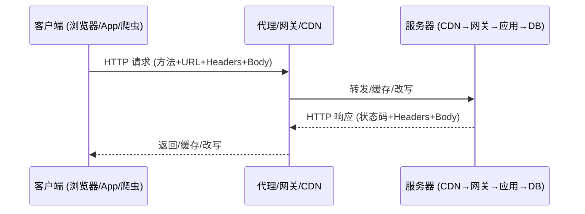

# HTTP 客户端/服务器架构

## 一句话定义
HTTP 是浏览器（客户端）与网站（服务器）通信的规矩：客户端发**请求**，服务器回**响应**；架构上还有代理、网关、CDN 等中间节点，它们会"看"或"改"流量——安全测试的关键切入点往往就在这些中间层。

## 核心架构 / 工作原理



| 组件 | 角色 | 安全关注点 |
|------|------|------------|
| **请求** | 方法 + URL + 版本 + Headers + Body | 参数注入、方法篡改、Header 注入 |
| **响应** | 状态码 + Headers + Body | 信息泄露、安全头缺失、XSS 载荷 |
| **中间节点** | 代理/网关/CDN/WAF | 缓存投毒、Header 注入、降级攻击 |
| **无状态性** | HTTP 本身不记忆 | 会话靠 Cookie/Token 维持（见 ② 组） |

## 快速上手步骤

1. **抓包看请求/响应**：用 Burp/ZAP/Postman 抓任意 HTTP 站点 → 观察请求行、头、体
2. **识别中间层**：看 `Via` `X-Forwarded-For` `Server` 等头 → 判断经过了哪些代理/CDN
3. **测明文风险**：在公共 WiFi 下访问 HTTP 站点 → 用 Wireshark 抓包 → 看账号密码/ Cookie 裸奔
4. **验证 HTTPS 强制**：访问 `http://example.com` → 应 301 跳 `https://` → 配合 HSTS（见安全头篇）

```bash
# 快速查看请求/响应头
curl -v https://example.com 2>&1 | head -30

# 测试中间层 Header 注入
curl -H "X-Forwarded-Host: evil.com" https://target.com
```

## 踩坑避坑指南

| 场景 | 问题现象 | 原因 | 解决/最佳实践 |
|------|----------|------|---------------|
| 以为客户端=浏览器 | 忽略 App/爬虫/API 调用方也是客户端 | 认知局限 | **客户端泛指发请求的一方**；安全测试需覆盖所有客户端类型 |
| 以为服务器=一台机器 | 忽略 CDN→网关→应用→DB 多层架构 | 认知局限 | **画出请求链路图**；每层都可能引入风险（缓存、Header 注入、降级） |
| HTTP 以为自动安全 | 默认明文，不加 TLS/头/鉴权全裸奔 | 认知局限 | **安全靠 TLS/安全头/鉴权/输入校验叠加**，非 HTTP 自带 |
| 忽略中间人风险 | 明文 HTTP 在代理/WiFi/运营商处被窃听篡改 | 未用 HTTPS | **全站强制 HTTPS + HSTS**；内网亦同（见 ② 组 TLS 篇） |

## 替代方案对比

| 维度 | HTTP/1.1 | HTTP/2 | HTTP/3 (QUIC) |
|------|----------|--------|---------------|
| 传输层 | TCP | TCP | UDP (QUIC) |
| 多路复用 | 管道化(弱) | 二进制分帧(强) | 原生流级多路复用 |
| 头压缩 | 无 | HPACK | QPACK |
| 队头阻塞 | 有 | 请求级无 | 连接级无 |
| 安全性 | 可选 TLS | 实质强制 TLS | 内置 TLS 1.3 |
| 适用场景 | 兼容性要求高 | 现代 Web 标配 | 高延迟/弱网/移动端 |

---

> 参考来源：https://www.thetechplatform.com/post/what-is-http-protocol-architecture-and-components-of-http

*下一篇：[HTTP 方法与语义](02-http方法.md)*