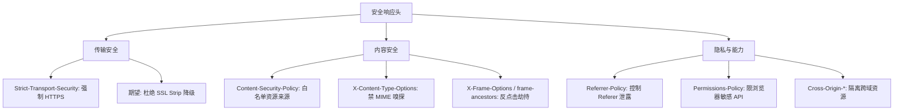

# HTTP 安全响应头（OWASP Secure Headers）

## 一句话定义
很多防护不用改代码，只要在响应里加对头。按 OWASP Secure Headers 清单补齐 HSTS/CSP/nosniff/anti-frame 等，是"零代码改动"的低成本防护。

## 核心架构 / 工作原理



## 必配清单（速查表）

| 响应头 | 推荐值 | 作用 | 防 |
|--------|--------|------|----|
| `Strict-Transport-Security` | `max-age=63072000; includeSubDomains; preload` | 强制 HTTPS、含子域、预加载列表 | SSL Strip 降级攻击 |
| `Content-Security-Policy` | 见 [CSP 篇](../03-浏览器安全/02-csp.md) | 限制脚本/样式/图片/连接来源 | XSS、数据外发 |
| `X-Content-Type-Options` | `nosniff` | 禁止浏览器 MIME 嗅探 | MIME 嗅探型 XSS |
| `X-Frame-Options` | `DENY` 或 `SAMEORIGIN` | 禁止/限同源被 iframe 嵌套 | 点击劫持 |
| `Referrer-Policy` | `strict-origin-when-cross-origin` | 同源全路径、跨域只源、降级无 | Referer 敏感信息泄露 |
| `Permissions-Policy` | `camera=(), microphone=(), geolocation=()` | 关闭不需的浏览器特性 | 设备能力滥用 |

> 新项目可直接用 CSP 的 `frame-ancestors` 替代 `X-Frame-Options`（二者并存更稳）。

## 快速上手步骤

1. **Nginx 配置示例**：
   ```nginx
   add_header Strict-Transport-Security "max-age=63072000; includeSubDomains; preload" always;
   add_header X-Content-Type-Options "nosniff" always;
   add_header X-Frame-Options "DENY" always;
   add_header Referrer-Policy "strict-origin-when-cross-origin" always;
   add_header Permissions-Policy "camera=(), microphone=(), geolocation=()" always;
   # CSP 单独配，见 CSP 篇
   ```
2. **Spring Boot 配置**：
   ```java
   http.headers(h -> h
     .httpStrictTransportSecurity(c -> c.maxAgeInSeconds(63072000).includeSubDomains(true))
     .contentTypeOptions(HeaderWriterFilter::nosniff)
     .frameOptions(c -> c.sameOrigin())
     .referrerPolicy(c -> c.policy(ReferrerPolicy.STRICT_ORIGIN_WHEN_CROSS_ORIGIN))
   );
   ```
3. **验证**：
   ```bash
   curl -I https://target.com | grep -iE "strict-transport|content-security|x-content|x-frame|referrer|permissions"
   # 或用 securityheaders.com 在线扫描
   ```

## 踩坑避坑指南

| 场景 | 问题现象 | 原因 | 解决/最佳实践 |
|------|----------|------|---------------|
| 有 HTTPS 以为够 | 首次访问仍可能 HTTP/被降级 | 缺 HSTS | **必须加 HSTS**；`preload` 需提交 hstspreload.org |
| CSP 配了以为万事大吉 | `default-src *` 等于没配 | 策略过宽 | **最小授权**：`default-src 'self'`；`script-src` 用 nonce/哈希白名单 |
| 靠框架默认头 | 很多框架默认缺失或宽松 | 未显式配置 | **显式加固**，勿信默认；用 securityheaders.com 扫描打分 |
| `X-Frame-Options` 冲突 CSP | 两者同时有但值不一致 | 配置不协调 | **CSP `frame-ancestors` 优先**；二者并存取更严格 |
| `Permissions-Policy` 误伤业务 | 关了地理位置导致地图失效 | 策略过严 | **按需开启**；业务用到的 API 必须显式允许 |

## 替代方案对比

| 维度 | 响应头防护 | WAF | CSP 专用库 | 代码级输出编码 |
|------|------------|-----|------------|----------------|
| 部署成本 | 极低(配置即生效) | 中(规则维护) | 低(集成库) | 高(全码改造) |
| 覆盖面 | 广(浏览器原生执行) | 流量特征匹配 | 仅脚本/资源加载 | 仅 XSS |
| 误报/误拦 | 无(浏览器标准) | 有(规则误判) | 低 | 低(若编码正确) |
| 维护 | 低(改配置) | 高(规则更新) | 中 | 中(新功能需编码) |
| 适用阶段 | 全阶段(首选基线) | 运行时兜底 | 开发期集成 | 开发期根治 |

---

> 参考来源：https://owasp.org/www-project-secure-headers/

*系列完：① 协议与架构*