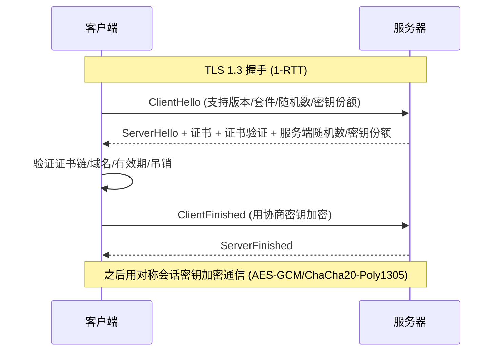

# TLS 握手与 HTTPS

## 一句话定义
HTTPS 不是新协议，而是"HTTP + TLS 加密"。理解 TLS 1.3 握手、证书校验、前向保密，才懂"为什么中间人看不懂"——这是所有 Web 安全的传输底座。

## 核心架构 / 工作原理



| 关键点 | TLS 1.2 | TLS 1.3 (推荐) |
|--------|---------|----------------|
| **握手往返** | 2-RTT | **1-RTT** (或 0-RTT 复用) |
| **密钥交换** | RSA/DHE/ECDHE | **仅 (EC)DHE** (强制前向保密) |
| **加密套件** | 多(含弱套件) | **仅 5 个强套件** (AES-GCM/ChaCha20-Poly1305) |
| **前向保密** | 可选 | **强制** (每次会话独立密钥) |
| **证书压缩** | 无 | 支持 |
| **禁用项** | SSLv3/TLS1.0/1.1/弱套件 | 彻底移除 |

## 快速上手步骤

1. **检查 TLS 版本与套件**：
   ```bash
   # 测试支持的版本/套件
   nmap --script ssl-enum-ciphers -p 443 target.com
   # 或
   openssl s_client -connect target.com:443 -tls1_3
   ```
2. **验证证书链**：
   ```bash
   openssl s_client -connect target.com:443 -showcerts -servername target.com
   # 看证书链完整性、域名匹配、有效期、吊销状态(OCSP/CRL)
   ```
3. **配置强化 (Nginx 示例)**：
   ```nginx
   ssl_protocols TLSv1.2 TLSv1.3;
   ssl_ciphers ECDHE-ECDSA-AES128-GCM-SHA256:ECDHE-RSA-AES128-GCM-SHA256:ECDHE-ECDSA-AES256-GCM-SHA384:ECDHE-RSA-AES256-GCM-SHA384:ECDHE-ECDSA-CHACHA20-POLY1305:ECDHE-RSA-CHACHA20-POLY1305;
   ssl_prefer_server_ciphers off;
   ssl_session_timeout 1d;
   ssl_session_cache shared:SSL:50m;
   ssl_stapling on;
   ssl_stapling_verify on;
   resolver 8.8.8.8 1.1.1.1 valid=300s;
   ```
4. **启用 HSTS + OCSP Stapling**：见安全头篇 + 上方配置

## 踩坑避坑指南

| 场景 | 问题现象 | 原因 | 解决/最佳实践 |
|------|----------|------|---------------|
| 有锁图标以为安全 | 证书可能无效/被诈/自签 | 未校验证书链 | **客户端必须校验**：域名匹配、链完整、有效期内、未吊销(OCSP/CRL) |
| 还在用 TLS 1.2 | 弱套件/无 PFS/易受降级攻击 | 未升级 | **优先 TLS 1.3**；若必用 1.2 则禁用 RSA 密钥交换、仅用 ECDHE |
| 内网不用 HTTPS | 内网嗅探/横向渗透 | 信任内网 | **全链路加密**：内网亦用 mTLS/Service Mesh/IPSec |
| 证书快过期未续期 | 服务中断/浏览器报警 | 运维疏忽 | **自动化续期**：Let's Encrypt + Certbot/acme.sh；监控证书到期(30/7/1 天告警) |
| 自签证书用于生产 | 浏览器报警/客户端拒连 | 无公信力 CA | **生产必须用公信 CA**；内网可建私有 CA + 分发根证书 |

## 替代方案对比

| 维度 | TLS 1.3 | TLS 1.2 (强配) | mTLS (双向认证) | IPSec / WireGuard |
|------|---------|----------------|-----------------|-------------------|
| 适用层 | 应用层 (HTTPS) | 应用层 | 应用层 | 网络层/传输层 |
| 认证 | 单向(服务端) | 单向 | **双向**(客户端+服务端证书) | 机器/网络级 |
| 前向保密 | 强制 | 可配置 | 强制 | 支持 |
| 部署复杂度 | 低(标准 HTTPS) | 低 | 中(需分发客户端证书) | 高(内核/网络配置) |
| 适用场景 | 所有 HTTPS | 兼容老客户端 | 零信任/服务间/物联网 | 站点间 VPN/容器网络 |

---

> 参考来源：https://www.cloudflare.com/learning/ssl/what-happens-in-a-tls-handshake/

*下一篇：[Web 缓存与缓存投毒](03-缓存投毒.md)*