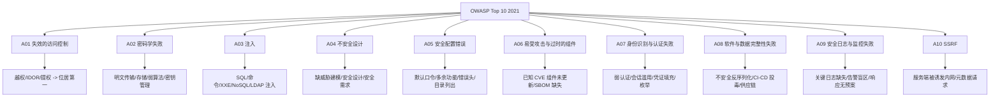

# OWASP Top 10（2021）

## 一句话定义
OWASP Top 10 是"最危险的 Web 应用安全风险"共识榜，是开发与安全测试的对齐基线——把它当优先级清单，再配 WSTG 做验证测试。

## 核心架构 / 工作原理



## 快速上手步骤

1. **对齐优先级**：项目风险评估时，按 A01→A10 排资源；A01(访问控制)与 A03(注入)通常投入最大
2. **映射 WSTG**：每个 Top 10 项对应 WSTG 具体测试类别(见 WSTG 篇) → 逐项验证
3. **CI/CD 门禁**：
   - SAST/SCA 覆盖 A03/A06/A08
   - DAST 覆盖 A01/A03/A07/A10
   - 依赖扫描覆盖 A06
   - 密钥扫描覆盖 A02
4. **合规报告**：审计/客户问"覆盖 Top 10 吗" → 给出 WSTG 测试记录 + 工具报告映射表

```bash
# 依赖漏洞快速扫 (A06)
npm audit / yarn audit
pip-audit / safety check
mvn org.owasp:dependency-check-maven:check
# 或用 OWASP Dependency-Check / Snyk / Trivy
```

## 踩坑避坑指南

| 场景 | 问题现象 | 原因 | 解决/最佳实践 |
|------|----------|------|---------------|
| 以为 Top 10 = 全部风险 | 忽略业务逻辑/供应链/新型攻击 | 它只是"十大"不穷尽 | **Top 10 是基线**，结合 WSTG/ASVS/业务威胁建模全覆盖 |
| 只盯 A03 注入 | A01 访问控制近年更致命 | 认知固化 | **按最新版排序投入**：A01 访问控制升至第一，资源倾斜授权测试 |
| 过了一遍就安全 | 无持续验证/回归/新组件引入 | 静态清单思维 | **持续集成**：每次发布跑 SAST/DAST/SCA；依赖每日扫；密钥推送前扫 |
| 只跑扫描器 | 逻辑漏洞/业务越权/配置错误扫不出 | 扫描器局限 | **人工测试配合工具**：WSTG 清单逐项勾；Burp/ZAP 做执行 |
| 与 WSTG 二选一 | 缺"怎么测"或缺"测什么优先" | 不懂互补关系 | **Top 10 排优先级 + WSTG 做验证**；形成"定范围→逐项测→出报告" |

## 替代方案对比

| 维度 | OWASP Top 10 | OWASP ASVS | MITRE ATT&CK | 业务威胁建模 |
|------|--------------|------------|--------------|--------------|
| 定位 | 风险优先级榜 | 验证标准(1-3 级) | 攻击战术/技术矩阵 | 系统级威胁识别 |
| 粒度 | 10 大类 | 200+ 具体要求 | 数百技术/子技术 | 资产/威胁/攻击面 |
| 用途 | 对齐基线/合规 | 需求/验收标准 | 红队/紫队/检测规则 | 设计期风险评估 |
| 更新频率 | ~3-4 年 | ~2 年 | 持续更新 | 项目级按需 |
| 适用阶段 | 全阶段(沟通语言) | 开发/验收/审计 | 运行时/红蓝对抗 | 设计期/架构评审 |

---

> 参考来源：https://owasp.org/Top10/

*下一篇：[OWASP WSTG 测试方法论](02-wstg.md)*