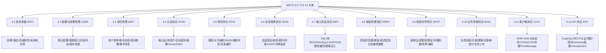

# OWASP WSTG 测试方法论

## 一句话定义
Top 10 告诉你"测什么风险"，WSTG 告诉你"怎么系统地测"。WSTG 是 Web/API 安全测试标准清单，按 12 个测试大类组织，每类下列具体测试项，并用 `WSTG-<类别>-<编号>` 标识——与 Burp/ZAP 等工具互补：WSTG 定清单，工具做执行。

## 核心架构 / 工作原理



| 场景 ID 体系 | 示例 | 引用建议 |
|--------------|------|----------|
| `WSTG-INFO-02` | 指纹识别 Web 服务器 | 带版本：`WSTG-v42-INFO-02` 或 `WSTG-v50-INFO-02` |
| `WSTG-ATHZ-04` | 测试不安全直接对象引用 (IDOR) | 同上 |
| `WSTG-APIT-03` | 测试 API 过度数据暴露 | 同上 |

## 快速上手步骤

1. **按项目裁剪清单**：
   - 纯 API 项目 → 重点 4.4/4.5/4.6/4.7/4.12
   - 传统 Web → 全 12 类，重点 4.1/4.3/4.4/4.5/4.7/4.11
   - 移动端 API → 加 4.12 + 移动专项
2. **工具落地映射**：
   - 4.1/4.2/4.3 → ZAP Spider/Active Scan + 手工侦察
   - 4.4/4.5/4.6/4.7 → Burp Repeater/Intruder/Sequencer/Session Handling
   - 4.7/4.11 → Burp DOM Invader + 手工前端审计
   - 4.12 → Postman/Newman + GraphQL Raider + 自动化契约测试
3. **报告映射**：每个发现映射 `WSTG-<类别>-<编号>` → 严重度 → 修复建议 → 复测

```bash
# 快速生成 WSTG 清单模板
# 参见 WSTG 知识库完整版
```

## 踩坑避坑指南

| 场景 | 问题现象 | 原因 | 解决/最佳实践 |
|------|----------|------|---------------|
| WSTG 当书照念 | 未按目标裁剪，面面俱到耗时 | 不懂"活清单" | **按资产/风险裁剪**：高危资产全测、低危抽测；Top 10 优先 |
| 只跑扫描对照 ID | 逻辑/业务/配置项仍需人工 | 扫描器覆盖盲区 | **扫描器做面(4.1/4.2/4.7/4.12 部分) + 人工做深(4.4/4.5/4.6/4.10/4.11)** |
| 与 Top 10 二选一 | 缺优先级或缺验证方法 | 不懂互补 | **Top 10 排优先级 + WSTG 做验证**；形成"定范围→逐项测→出报告" |
| ID 引用不带版本 | 5.0 与 4.2 编号不一致 | 版本演进 | **引用必带版本**：`WSTG-v42-ATHZ-04` 或 `WSTG-v50-ATHZ-04` |
| 只测技术漏洞 | 忽略业务逻辑/配置/设计缺陷 | 关注点偏技术 | **4.10 业务逻辑 + 4.2 配置 + 4.4 设计缺陷** 必测 |

## 替代方案对比

| 维度 | WSTG | OWASP ASVS | PTES | 企业内部清单 |
|------|------|------------|------|--------------|
| 定位 | 测试执行清单 | 验证要求标准 | 渗透测试执行标准 | 组织定制 |
| 粒度 | 测试项/步骤 | 验证要求(1-3 级) | 阶段/任务 | 视组织而定 |
| 场景 ID | `WSTG-XXX-NN` | `Vx.y.z` | 无标准 ID | 自定义 |
| 工具映射 | 明确(Burp/ZAP/Postman) | 需自行映射 | 需自行映射 | 视清单 |
| 更新 | 社区持续 | ~2 年版本 | 社区 | 内部节奏 |
| 适用 | 渗透测试/安全验收 | 需求/开发/验收 | 红队/渗透执行 | 内部合规 |

---

> 参考来源：https://owasp.org/www-project-web-security-testing-guide/

*下一篇：[JWT（含 Scopes）](03-jwt.md)*