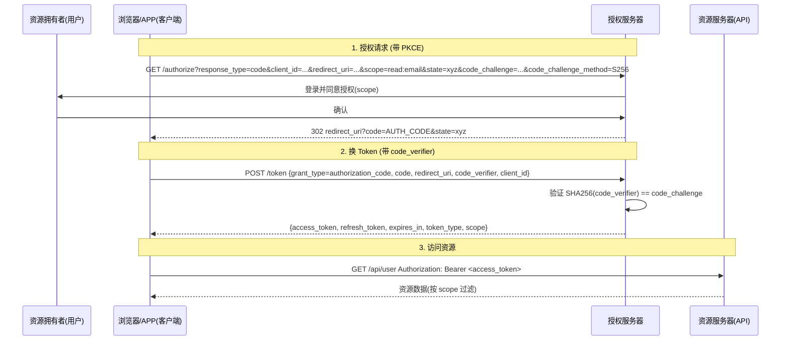

# OAuth 2.0（含 Scopes）

## 一句话定义
OAuth 2.0 解决"授权第三方访问"的问题，是现代登录/对接的事实标准。核心是**访问令牌 (access token)** + **授权码流程**；公开客户端(SPA/移动端)必须用 **PKCE** 防拦截；用 **Scopes** 做最小授权。

## 核心架构 / 工作原理



| 角色 | 职责 |
|------|------|
| **资源拥有者** | 拥有数据的用户 |
| **客户端** | 请求访问的应用(SPA/移动端/服务端) |
| **授权服务器** | 颁发令牌、管理授权同意 |
| **资源服务器** | 保护资源、校验令牌与 scope |

| 流程类型 | 适用场景 | 关键点 |
|----------|----------|--------|
| **Authorization Code + PKCE** | SPA/移动端/公开客户端 | **强制 PKCE**；无 Client Secret；code_verifier 防授权码劫持 |
| **Client Credentials** | 服务间/机器对机器 | 无用户交互；Client ID/Secret 换 Token |
| **Device Code** | CLI/TV/IoT 无浏览器设备 | 用户在别设备授权；轮询 Token 端点 |
| **Resource Owner Password** | **已废弃/极度慎用** | 客户端直接收集密码，违背委托初衷 |

## 快速上手步骤

1. **配置授权服务器 (Keycloak/Auth0/自建)**：
   - 建客户端：类型 `Public`(SPA) / `Confidential`(服务端)
   - 设 `redirect_uri` 白名单、允许 `scope` 列表
   - 开启 PKCE 必选、设 Access Token 短时(15-30min)、Refresh Token 轮换
2. **前端集成 (SPA 示例)**：
   ```javascript
   // 简化版 Authorization Code + PKCE
   const codeVerifier = randomString(64);
   const codeChallenge = base64url(sha256(codeVerifier));
   const state = randomString(32);
   
   location.href = `https://auth.example.com/authorize?` +
     `response_type=code&client_id=spa-client&` +
     `redirect_uri=https://app.example.com/callback&` +
     `scope=read:profile write:orders&` +
     `state=${state}&code_challenge=${codeChallenge}&code_challenge_method=S256`;
   
   // 回调页收到 code -> 后端/前端换 token
   fetch('https://auth.example.com/token', {
     method: 'POST',
     body: new URLSearchParams({
       grant_type: 'authorization_code',
       code: urlParams.get('code'),
       redirect_uri: 'https://app.example.com/callback',
       code_verifier: codeVerifier,  // 关键：PKCE 验证
       client_id: 'spa-client'
     })
   }).then(r => r.json()).then(tokens => {
     // 存 access_token (内存) + refresh_token (HttpOnly Cookie/安全存储)
   });
   ```
3. **Scope 设计**：
   - 粒度：`read:profile` `write:orders` `admin:users` (资源:动作)
   - 用户同意界面逐项勾选 → 令牌仅含同意的 scope
   - 资源服务器按 scope 过滤返回字段/允许的操作

## 踩坑避坑指南

| 场景 | 问题现象 | 原因 | 解决/最佳实践 |
|------|----------|------|---------------|
| OAuth 当认证协议 | "用第三方登录"还需授权后做身份认证 (OIDC) | 认知混淆 | **OAuth=授权，OIDC=认证**；登录用 OpenID Connect(`openid` scope) |
| 公开客户端藏 Client Secret | SPA/移动端无法保密 | 架构限制 | **必须用 PKCE**；不存 Secret；Authorization Code + PKCE 是标配 |
| Scope 申请多少给多少 | 过度授权/用户不知情/服务端不校验 | 最小授权未落地 | **最小授权**：按需申请、用户逐项同意、服务端按 scope 过滤数据/操作 |
| 无 state 参数 | CSRF 攻击者诱导授权绑定其账号 | 缺 CSRF 防护 | **每次授权请求生成随机 state** → 回调严格校验 |
| Refresh Token 不轮换 | 泄露后永久有效、无法撤销 | 安全性缺失 | **每次刷新发新 Refresh Token、废旧**；检测重放→撤销整个授权链 |
| Access Token 长期有效 | 泄露窗口大、无法快速撤销 | 图省事 | **短时 Access Token(15-30min)** + **Refresh Token 轮换** |

## 替代方案对比

| 维度 | OAuth 2.0 | OpenID Connect (OIDC) | SAML 2.0 | JWT 直接传递 |
|------|-----------|----------------------|----------|--------------|
| 核心定位 | 授权框架 | 认证+授权(在 OAuth 上) | 企业级 SSO/联邦 | 无状态令牌传递 |
| 令牌格式 | 不规定(常 JWT) | ID Token(JWT) + Access Token | SAML Assertion(XML) | JWT |
| 用户登录 | 需额外身份层 | 原生支持(Authorization Code + openid) | 原生支持 | 无(需自建) |
| 适用场景 | 第三方授权/微服务/委托 | 登录/SSO/身份联邦 | 企业 SSO/政府/旧系统 | 服务间/简单鉴权 |
| 复杂度 | 中 | 中高 | 高 | 低 |

---

> 参考来源：https://www.digitalocean.com/community/tutorials/an-introduction-to-oauth-2

*下一篇：[用 Postman 调 OAuth2 接口](06-postman调oauth2.md)*