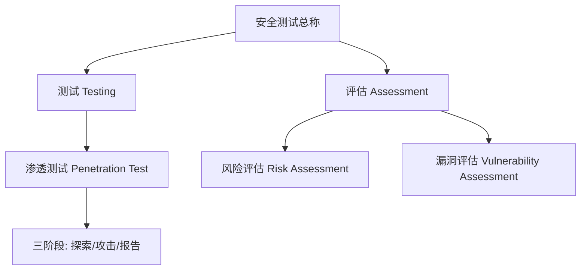

# 安全测试与渗透测试到底差在哪

## 一句话定义
安全测试是评估系统、发现风险与漏洞的整个过程总称；渗透测试是其中"模拟真实攻击、验证漏洞可被利用"的专门手段。

## 核心架构 / 工作原理

| 概念 | 核心动作 | 典型产出 |
|------|----------|----------|
| 风险评估 (RA) | 识别资产/威胁/漏洞 → 量化/定性风险 | 风险优先级清单 |
| 漏洞评估 (VA) | 自动化工具扫描已知弱点 | 弱点清单 (CVE/配置) |
| 渗透测试 (PT) | 授权团队模拟真实攻击验证可利用性 | 验证报告 + 复现步骤 |

## 快速上手步骤

1. **明确目标与授权**：拿到书面授权，圈定测试范围
2. **选择评估类型**：按需求选 RA（算账）、VA（找洞）、PT（打洞）
3. **执行渗透测试三阶段**：
   - Explore：爬取/被动监听 → 画出站点地图
   - Attack：用 Repeater/Intruder/Scanner 验证漏洞
   - Report：整理漏洞、利用链、严重度、修复建议
4. **交付与复测**：提交报告 → 开发修复 → 回归验证

## 踩坑避坑指南

| 场景 | 问题现象 | 原因 | 解决/最佳实践 |
|------|----------|------|---------------|
| 只做扫描不做验证 | 报告全是"疑似漏洞" | 只做了 VA 没做 PT | 必须用 PT 验证高危项可利用性 |
| 风险评估当测试用 | 只有风险等级无复现步骤 | RA 只分析严重程度不动手测 | RA 指导优先级，PT 落实验证 |
| 渗透测试越快越好 | 漏报隐性漏洞(授权/会话) | 追求速度跳过深度探索 | 预留足够 Explore 时间，手测补全盲区 |
| 未圈定 Scope | 误伤生产/关联系统 | 扫描器把流量撒到外网 | Target 里严格设 Scope，只扫授权目标 |

## 替代方案对比

| 维度 | 人工渗透测试 | 自动化扫描器 (Scanner) | BAS (Breach and Attack Simulation) |
|------|--------------|------------------------|-----------------------------------|
| 覆盖深度 | ✅ 深度业务逻辑 | ⚠️ 仅已知特征/通用漏洞 | ⚠️ 预设攻击场景 |
| 误报率 | ✅ 极低(真打验证) | ❌ 高(需人工排查) | ⚠️ 中等 |
| 速度 | ❌ 慢(天/周) | ✅ 快(小时) | ✅ 快(分钟/小时) |
| 成本 | ❌ 高(专家工时) | ✅ 低(订阅制) | ⚠️ 中(平台费) |
| 适用场景 | 高价值资产/合规/红蓝对抗 | CI/CD 门禁/资产全景 | 持续验证/紫队演练 |

---

> 参考来源：*OWASP ZAP 2.11 Getting Started Guide*（本文为原创讲解，非转载原文）

*下一篇：[ZAP 是什么 & 中间人代理怎么干活](02-ZAP与中间人代理.md)*