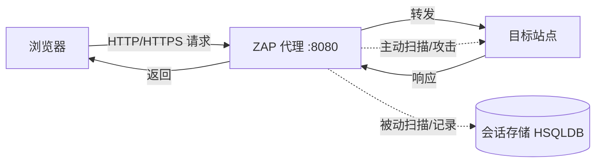

# ZAP 是什么 & 中间人代理怎么干活

## 一句话定义
ZAP (Zed Attack Proxy) 是 OWASP 旗下免费开源的 Web 应用渗透测试工具，核心能力源于"中间人代理"架构——夹在浏览器与目标站点之间拦截、查看、篡改所有 HTTP/HTTPS 流量。

## 核心架构 / 工作原理



- **中间人定位**：浏览器配置代理指向 ZAP (默认 127.0.0.1:8080)，ZAP 再转发给目标；回程同理
- **HTTPS 解密**：ZAP 自签 CA 证书 → 导入浏览器信任库 → ZAP 能解密查看明文
- **会话持久化**：HSQLDB 存储 Sites 树、告警、脚本；首次启动可选是否持久化

## 快速上手步骤

1. **下载安装**：<https://www.zaproxy.org/download/> → 选跨平台版/安装包/Docker
2. **装 Java 依赖**：跨平台/Windows/Linux 需 Java 8+；Mac 安装包自带
3. **启动 ZAP**：首次弹窗选"No"（不持久化会话，新手推荐）
4. **配置浏览器代理**：系统/浏览器代理 → 127.0.0.1:8080
5. **信任 CA 证书**：访问 `http://zap` → 下载证书 → 导入"受信任的根证书颁发机构"
6. **验证流通**：访问任意 HTTPS 站点 → ZAP Sites 树出现目标 → 成功

```bash
# Docker 快速启动（无需装 Java）
docker run -u root -p 8080:8080 -i owasp/zap2docker-stable zap.sh -daemon -host 0.0.0.0 -port 8080 -config api.disablekey=true
```

## 踩坑避坑指南

| 场景 | 问题现象 | 原因 | 解决/最佳实践 |
|------|----------|------|---------------|
| HTTPS 全是乱码/报错 | 浏览器提示证书不受信任 | CA 证书未装入系统根存储 | 必须导入"受信任的根证书颁发机构"，非"中间证书" |
| 流量不过 ZAP | Sites 树为空 | 代理端口冲突/浏览器未走代理 | 检查 8080 占用；用 FoxyProxy 一键切换 |
| Mac 启动报错 | "损坏的应用" | Gatekeeper 拦截未签名应用 | `xattr -d com.apple.quarantine /Applications/OWASP\ ZAP.app` |
| 会话丢失 | 重启后记录全无 | 首次选了"No"不持久化 | 正式测试选"Yes"并命名会话文件 |
| 公司有上级代理 | ZAP 连不上外网 | 需级联上级代理 | Tools → Options → Connection → Use proxy chain |

## 替代方案对比

| 维度 | OWASP ZAP | Burp Suite Pro | Caido | mitmproxy |
|------|-----------|----------------|-------|-----------|
| 价格 | 免费开源 | $449/年 | 免费/商业版 | 免费开源 |
| 核心能力 | 扫描+手测+自动化 | 扫描+手测+插件生态 | 现代 UI+手测 | 代理+脚本可编程 |
| 扫描器质量 | 良(社区规则) | 优(商业规则+研发) | 较弱 | 无内置扫描器 |
| 自动化/CI | Docker/GitHub Actions/API | CLI/API/Bamboo | CLI | CLI/Python API |
| 学习曲线 | 中等 | 陡峭 | 平缓 | 陡峭(需写脚本) |
| 适合场景 | 入门/预算 0/开源审计 | 专业渗透/赏金/企业 | 现代团队/手测为主 | 开发者/自动化集成 |

---

> 参考来源：*OWASP ZAP 2.11 Getting Started Guide*（本文为原创讲解，非转载原文）

*下一篇：[ZAP 桌面界面与"安全模式"红线](03-桌面界面与安全模式.md)*