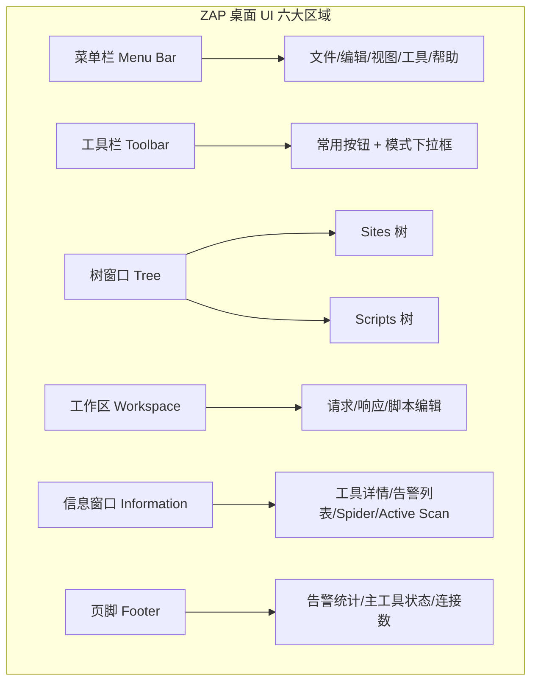

# ZAP 桌面界面与"安全模式"红线

## 一句话定义
ZAP 桌面由六大功能区组成；"安全模式"是把 ZAP 限制为仅被动扫描的保护开关，防止对无授权目标发起主动攻击。

## 核心架构 / 工作原理



| 区域 | 核心功能 | 常用操作 |
|------|----------|----------|
| 菜单栏 | 所有功能总入口 | File→New Session、Tools→Active Scan、Help→Check for Updates |
| 工具栏 | 高频动作快捷键 | 模式切换、新建站点、蜘蛛、扫描、拦截开关 |
| Sites 树 | 站点地图可视化 | 右键→Attack→Active Scan、右键→Include in Context |
| 工作区 | 请求/响应查看改写 | Request/Response/Headers/Body/Hex 标签切换 |
| 信息窗口 | 工具运行详情 | Alerts 标签看漏洞、Spider 标签看爬取进度 |
| 页脚 | 全局状态监控 | 告警计数(高/中/低/信息)、活动扫描器状态 |

## 快速上手步骤

1. **认界面**：启动后默认显示六大区域；隐藏标签页点右侧绿"+"或右键唤出
2. **开安全模式**：工具栏模式下拉框 → 选 **Safe Mode** → 图标变盾牌
3. **建会话上下文**：Sites 树右键目标 → Include in Context → New Context → 命名
4. **配置认证(可选)**：Context → Authentication → 选 Form-based/Script-based → 填登录流程
5. **开始测试**：退出 Safe Mode → 对 Context 右键 Attack → Active Scan

```bash
# 命令行直接以 Safe Mode 启动
zap.sh -daemon -config mode.safe=true -port 8080
```

## 踩坑避坑指南

| 场景 | 问题现象 | 原因 | 解决/最佳实践 |
|------|----------|------|---------------|
| 忘开 Safe Mode 就扫 | 对无授权站点发起攻击 | 疏忽/不懂模式区别 | **养成习惯：启动即开 Safe Mode，拿到授权再关** |
| 找不到某功能标签 | 界面似乎缺功能 | 许多高级标签默认隐藏 | 点右侧绿"+"、右键标签栏、View 菜单勾选 |
| 被动扫描也怕误伤 | 不敢开被动扫描 | 误以为被动也会改流量 | 被动扫描**只读不改**，完全安全，放心开 |
| Safe Mode 下无法手测 | Repeater/Intruder 灰掉 | Safe Mode 禁用主动功能 | 手测时临时关 Safe Mode，测完立刻开回 |
| 多项目切换混乱 | Sites 树混在一起 | 没用 Session/Context 隔离 | 每项目建独立 Session 文件 + Context |

## 替代方案对比

| 维度 | ZAP 桌面 | ZAP Daemon/API | Burp Suite UI |
|------|----------|----------------|---------------|
| 适合场景 | 交互式探索/手测/学习 | CI/CD 自动化/无头扫描 | 专业渗透/复杂手测 |
| 资源占用 | 高(Java GUI) | 低(无界面) | 高 |
| 可视化 | 完整六区界面 | 无(靠 API/日志) | 完整 |
| 手测效率 | 良(快捷键/右键菜单) | 不适用 | 优(Repeater/Intruder 强) |
| 学习成本 | 中等 | 高(需懂 API) | 高 |

---

> 参考来源：*OWASP ZAP 2.11 Getting Started Guide*（本文为原创讲解，非转载原文）

*下一篇：[自动扫描：蜘蛛、被动扫描与主动扫描](04-自动扫描蜘蛛与被动主动.md)*

> 💡 **配图建议**：在"核心架构"处嵌入 ZAP 桌面全屏截图，标注六大区域编号；在"安全模式"处放工具栏模式下拉框特写(Standard/Protected/Safe/ATK 模式对比)。