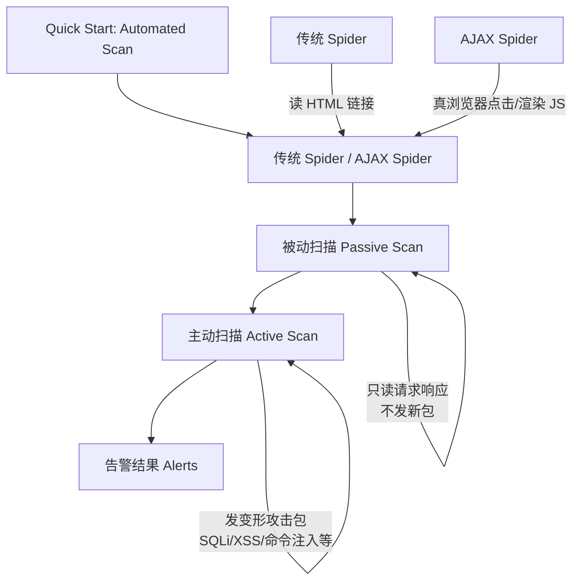

# 自动扫描：蜘蛛、被动扫描与主动扫描

## 一句话定义
ZAP 自动扫描 = **蜘蛛爬行**发现攻击面 + **被动扫描**安全摸底 + **主动扫描**真攻击验证漏洞可利用性。

## 核心架构 / 工作原理



| 组件 | 触发方式 | 是否发包 | 速度 | 适用场景 |
|------|----------|----------|------|----------|
| 传统 Spider | 自动/手动 | 否(只读已有响应) | 极快 | 静态页面、服务端渲染站点 |
| AJAX Spider | 手动/自动 | 是(驱动真浏览器) | 慢 | SPA、大量 JS 动态生成链接 |
| 被动扫描 | 自动(后台常驻) | 否 | 实时 | 所有流量持续安全摸底 |
| 主动扫描 | 手动/自动 | 是(真攻击) | 慢 | 授权目标、验证漏洞真实性 |

## 快速上手步骤

1. **配置 Context**：Sites 树右键目标 → Include in Context → 命名(如 `myapp`)
2. **选蜘蛛类型**：
   - 普通站点：默认传统 Spider
   - SPA/重 JS：Tools → AJAX Spider → 选 Context → Start
3. **一键自动扫描**：Quick Start 标签 → Automated Scan → 填 URL → 选 Context → Attack
4. **或分步手动**：
   - Spider 爬完 → 右键 Context → Attack → Active Scan
   - 调整扫描策略：Active Scan 标签 → 扫描策略 → 调强度/速度/排除项
5. **看进度**：信息窗口 Spider/Active Scan 标签；页脚扫描器状态

```bash
# CLI 无头自动扫描(含 AJAX Spider)
zap.sh -cmd -quickurl https://target.com -quickprogress -quickout /tmp/report.html
```

## 踩坑避坑指南

| 场景 | 问题现象 | 原因 | 解决/最佳实践 |
|------|----------|------|---------------|
| 爬不到登录后页面 | Sites 树只有登录页 | Spider 无法处理认证 | Context 配置 Authentication(Form-based/Script-based) 或手动登录后再爬 |
| AJAX Spider 起不来 | 报错/浏览器闪退 | 无头环境缺依赖 | Docker 需 `--cap-add=SYS_ADMIN`；或装 `libnss3 libatk-bridge2.0-0 libgtk-3-0` |
| 主动扫描把站打挂 | 目标宕机/锁账号/脏数据 | 扫描强度过大/无节制 | 降低强度、限速、排除登录/支付/删除类接口、用 Scope 圈范围 |
| 扫很久不出结果 | Active Scan 卡住 | 遇到大量参数组合爆炸 | 设最大扫描时间、限制每参数载荷数、排除无用参数 |
| 误报太多 | 告警全是低风险/信息泄露 | 被动规则宽泛 | 关注高/中危；用 Alert Filters 隐藏信息级；人工复核高危项 |

## 替代方案对比

| 维度 | ZAP 自动扫描 | Burp Scanner Pro | Nuclei | Nikto |
|------|--------------|------------------|--------|-------|
| 规则来源 | 社区规则 + 核心 | 商业规则库(更新快) | 社区 YAML 模板(极丰富) | 老牌 CGI 扫描器 |
| SPA 支持 | AJAX Spider(配置繁琐) | 内置无头浏览器(较好) | 无(需配合浏览器) | 无 |
| 误报率 | 中等 | 低 | 低(模板精确) | 高 |
| 可定制性 | 扫描策略/脚本 | 扩展/BApp | 模板易写/易改 | 差 |
| CI/CD 集成 | Docker/GitHub Actions | CLI/Bamboo | 原生 CLI 极简 | CLI |
| 价格 | 免费 | $449/年 | 免费 | 免费 |

---

> 参考来源：*OWASP ZAP 2.11 Getting Started Guide*（本文为原创讲解，非转载原文）

*下一篇：[读懂结果 & 为什么还要手动探索](05-读懂结果与手动探索.md)*

> 💡 **配图建议**：在"核心架构"处放 Quick Start Automated Scan 向导截图(三步:URL/Context/Attack)；在"蜘蛛对比"处放传统 Spider 与 AJAX Spider 爬取结果对比图(树节点数差异)；在"主动扫描"处放扫描策略配置面板截图(强度/速度/阈值滑块)。