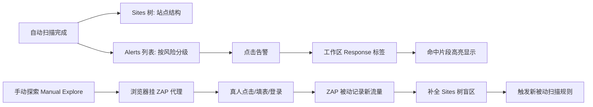

# 读懂结果 & 为什么还要手动探索

## 一句话定义
自动扫描产出告警列表，**看结果三步走**：Sites 树定位 → Alerts 列表分级 → Response 高亮看证据；但自动扫描有盲区，**手动探索**是补全覆盖的必要补充。

## 核心架构 / 工作原理



| 视图 | 入口 | 核心信息 | 操作 |
|------|------|----------|------|
| Sites 树 | 左侧树窗口 | URL 层级、参数、技术栈标记 | 右键→Attack/Include in Context/Open in Browser |
| Alerts 列表 | 信息窗口 Alerts 标签 | 风险等级、漏洞类型、URL、CWE、置信度 | 双击→工作区看请求/响应/证据 |
| Response 高亮 | 工作区 Response 标签 | 漏洞触发点在响应中的位置(黄高亮) | 复制 Payload 验证/上报开发 |
| HUD 抬头显示 | 手动探索浏览器右上角 | 实时告警计数、请求详情、编码切换 | 点图标展开/收起、切 Request/Response |

## 快速上手步骤

1. **看告警总览**：页脚左侧告警计数(高/中/低/信息) → 点信息窗口 Alerts 标签
2. **按风险分级看**：
   - **高危**：SQLi、命令注入、路径遍历、认证绕过 → 优先复现
   - **中危**：反射 XSS、CSRF、敏感信息泄露、不安全配置 → 评估影响
   - **低危/信息**：版本泄露、Cookie 缺属性、目录列表 → 记录备查
3. **验证复现**：双击告警 → 工作区 Request 标签 → 发送到 Repeater(右键) → 修改 Payload 再发 → 看是否稳定复现
4. **手动探索补盲区**：
   - Quick Start → Manual Explore → 填 URL → Launch Browser
   - 浏览器自动挂 ZAP 代理、忽略证书错误、开启 HUD
   - **重点补**：登录流程、多步表单、AJAX 动态加载、隐藏页面、WebSocket
5. **导出报告**：Report → Generate HTML Report → 选告警范围/模板 → 导出

```bash
# CLI 导出报告
zap.sh -cmd -quickurl https://target.com -quickout /tmp/report.html -quickprogress
```

## 踩坑避坑指南

| 场景 | 问题现象 | 原因 | 解决/最佳实践 |
|------|----------|------|---------------|
| 只看告标题不看证据 | 把误报当真漏洞上报 | 未点开 Response 看高亮 | **必须看高亮片段**，确认触发点在业务逻辑里而非静态资源 |
| 告警数几百个不敢动 | 无从下手 | 未按风险/置信度排序 | Alerts 标签点 Risk/Confidence 列排序；先清高危+高置信度 |
| 手动探索没新发现 | Sites 树没变 | 只点已爬到的链接 | **故意输错、跳步、并发、改参数**，触发异常分支 |
| HUD 遮挡页面内容 | 看不清目标站点 | HUD 默认右上角固定 | 点 HUD 齿轮图标→调位置/透明度/最小化；或用 `Ctrl+Shift+H` 切换 |
| 登录态丢失 | 手动探索中途被踢 | Session 过期/CSRF token 失效 | Context 配好 Authentication；或用 Session Handling Rules 维持会话 |

## 替代方案对比

| 维度 | ZAP 结果分析 + 手动探索 | Burp Suite Logger/Repeater | 纯人工渗透测试 |
|------|-------------------------|----------------------------|----------------|
| 告警去重/分级 | 内置风险/置信度/计数 | 需人工整理/或用插件 | 完全人工 |
| 证据定位 | Response 高亮直观 | 需在 Response 里找 | 截图/手记 |
| 盲区补全 | Manual Explore + HUD | 手动浏览器+代理 | 全靠人经验 |
| 协作/报告 | HTML/JSON/MD 报告模板 | 报告功能强/可定制 | Word/Confluence 手写 |
| 学习门槛 | 低(可视化/HUD) | 高(需懂工具链) | 极高 |

---

> 参考来源：*OWASP ZAP 2.11 Getting Started Guide*（本文为原创讲解，非转载原文）

*下一篇：[进阶与自动化：插件市场与持续集成](06-进阶与自动化.md)*

> 💡 **配图建议**：在"核心架构"处放 Alerts 列表截图(按 Risk 排序、显示 CWE/Confidence)；在"Response 高亮"处放工作区 Response 标签截图(黄色高亮 SQLi Payload 位置)；在"手动探索"处放 HUD 叠加在浏览器上的截图(右上角告警计数、请求详情面板)。