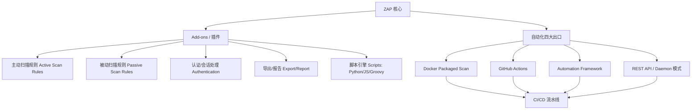

# 进阶与自动化：插件市场与持续集成

## 一句话定义
ZAP 的扩展能力靠 **Marketplace 插件** 动态加载，**自动化框架/API/Docker/GitHub Actions** 四大出口把 ZAP 嵌入 CI/CD，实现"每次提交自动扫描"。

## 核心架构 / 工作原理



| 扩展点 | 入口 | 典型用例 |
|--------|------|----------|
| Marketplace | Tools → Manage Add-ons → Marketplace 标签 | 装 Active Scan++、OpenAPI Import、GraphQL、OAuth、SAML |
| 脚本引擎 | 右侧 Scripts 树 → 右键 New Script | 自定义认证流程、特殊编解码、业务逻辑断言 |
| Automation Framework | Tools → Automation → .yaml/.job 文件 | 可视化编排：Spider→Passive→Active→Report 全流程 |
| REST API | `http://127.0.0.1:8080/UI/.../action/` | 程序控制启动扫描、拉取告警、导出报告 |
| Daemon 模式 | `zap.sh -daemon -port 8080` | 长驻后台服务，多任务共享实例 |

## 快速上手步骤

1. **装常用插件**：
   - Manage Add-ons → Marketplace → 搜索安装：
     - **Active Scan++** (增强主动扫描规则)
     - **OpenAPI Import** (导入 Swagger/OpenAPI 定义当攻击面)
     - **GraphQL** (支持 GraphQL 端点探测/扫描)
     - **OAuth Support** (OAuth 1.0a/2.0 认证辅助)
2. **写 Automation Plan** (`scan.yaml`)：
   ```yaml
   env:
     contexts:
       - name: "myapp"
         urls: ["https://target.com"]
         authentication:
           method: "formBasedLogin"
           loginUrl: "https://target.com/login"
           loginRequestData: "username=&password="
   
   jobs:
     - name: "full-scan"
       type: "activeScan"
       context: "myapp"
       policy: "Default Policy"
       failOnError: true
       failOnWarning: false
   ```
3. **接入 GitHub Actions** (`.github/workflows/zap-scan.yml`)：
   ```yaml
   name: ZAP Scan
   on: [push, pull_request]
   jobs:
     zap:
       runs-on: ubuntu-latest
       steps:
         - uses: actions/checkout@v4
         - name: Run ZAP Scan
           uses: zaproxy/action-full-scan@v0.10.0
           with:
             target: 'https://staging.example.com'
             rules_file_name: 'scan.yaml'
             cmd_options: '-a'
   ```
4. **或用 Docker 直接跑**：
   ```bash
   docker run -t owasp/zap2docker-stable zap-full-scan.py \
     -t https://target.com -r report.html -J scan.yaml
   ```

## 踩坑避坑指南

| 场景 | 问题现象 | 原因 | 解决/最佳实践 |
|------|----------|------|---------------|
| CI 里扫描超时/卡死 | 流水线挂起数小时 | 目标大/扫描强度高/无超时设置 | Automation Plan 设 `maxDuration`/`maxRuleDuration`；或分阶段扫(先被动后主动) |
| 插件装多了报错/慢 | 启动慢、扫描报错 | 插件冲突/版本不兼容 | **按需装、定期清理**；核心插件锁定版本；出问题先禁用排查 |
| GitHub Actions 连不上内网目标 | 扫描失败 | Runner 在公网无法访问内网 | 用 Self-hosted Runner；或 SSH 隧道/VPN/Cloudflare Tunnel |
| 认证配置在 CI 失效 | 登录不上/Session 过期 | 环境变量/Secrets 未正确注入 | 用 GitHub Secrets 存账号密码 → Automation Plan 引用 `${{ secrets.ZAP_USER }}` |
| 报告太大/不生成 | CI 产物上传失败/为空 | 未配置报告导出/磁盘满 | Plan 里加 `report:` 节点指定模板/路径；定期清理 artifacts |

## 替代方案对比

| 维度 | ZAP 自动化 | Burp Suite Enterprise | GitLab SAST | GitHub CodeQL | Nuclei + CI |
|------|------------|----------------------|-------------|---------------|-------------|
| 扫描类型 | DAST(动态) | DAST/IAST | SAST/DAST | SAST | DAST(模板制) |
| 规则维护 | 社区/插件 | 商业团队 | 厂商/社区 | GitHub 官方 | 社区模板(极活跃) |
| CI 集成难度 | 中(YAML/Action) | 低(原生插件) | 低(内置) | 低(内置) | 低(单二进制) |
| 运行速度 | 慢(需真跑应用) | 慢 | 快(静态) | 快(静态) | 快(无头/模板) |
| 业务逻辑覆盖 | 靠 Automation/脚本 | 靠扩展/配置 | 无 | 无 | 靠模板编写 |
| 成本 | 免费(自建算力) | 高(授权费) | 免费额度后付费 | 免费(公开仓) | 免费 |

---

> 参考来源：*OWASP ZAP 2.11 Getting Started Guide*（本文为原创讲解，非转载原文）

*系列完*

> 💡 **配图建议**：在"核心架构"处放 Manage Add-ons Marketplace 标签截图(搜索框、已装/可用列表)；在"Automation Framework"处放 Automation 编排界面截图(左侧职业列表、右侧 YAML 编辑器)；在"GitHub Actions"处放 Actions 运行日志截图(显示 ZAP 启动、爬取、扫描、报告生成各步骤耗时)。